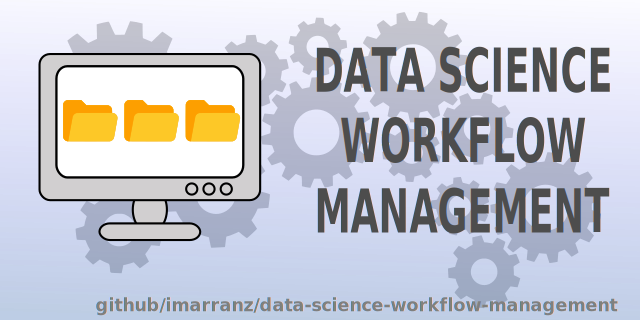
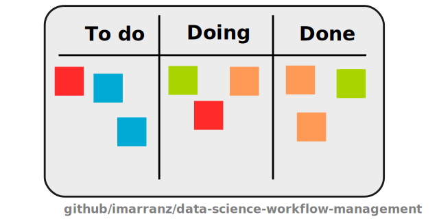
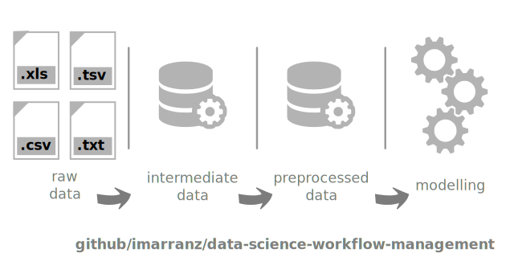
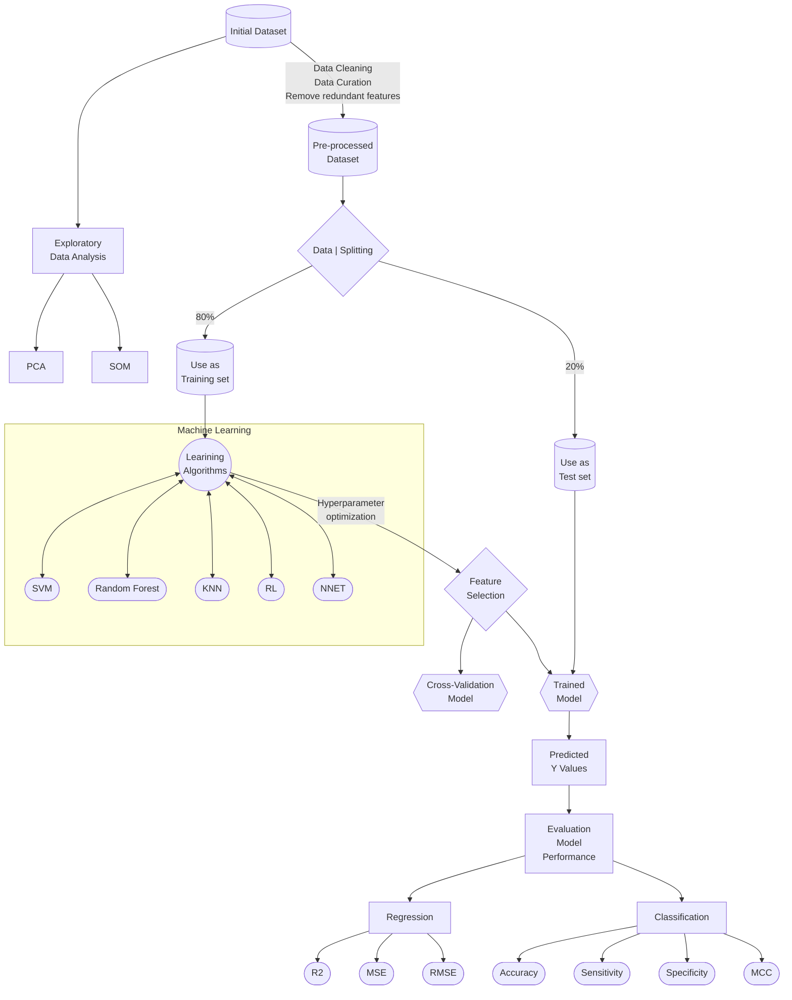
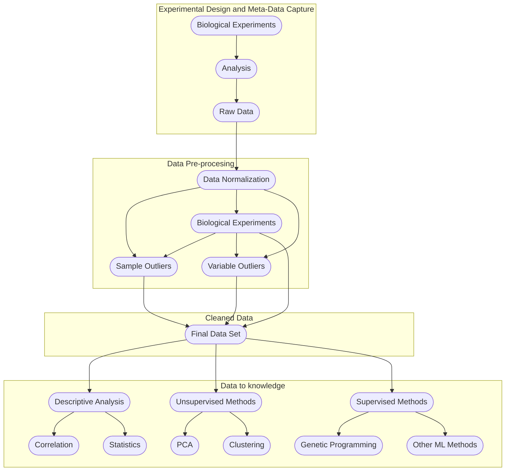

**Version and Activity**


<br>
**Analysis**

<br>

# Data Science Workflow Management



## Introducction

A good workflow means better results and reproducible researchs. A first step is to work with a nice structure of files and folders. In this repository I want to show _my_ workflow, it is not the best (I know) and for this reason I want to improve it. First, I followed the icebreakeR guidelines, and that was my first attempt at creating an efficient working structure. Later, new libraries and tools and Python as Data Science language were appearing. This changes made me to modify the primary structure. Besides, tools as github force us to add files as README.md or .gitignore.

In an efficient workflow, there is no only a good structure of files and folders, something more is needed. I usually use a [kanban](https://en.wikipedia.org/wiki/Kanban) methodology. A brief description of a kanban methodology starts with the means of _kanban_ word. It is a Japanese word that means _cards_. Each card identifies one process: definition, aim, person assings to that process and deadlines. Further, each _kanban_ is in blackboard that usually is divided in three columns: **to do**, **doing** (or in process) and **done**. Others columns can be added if the process requires it. We can also add tags to each card: _urgent_, _document_, _question_, _validation_, ... These tags facilitate you to give priorities to each subprocess.



At this point I think github is a good tool to work with _kanban_. In each repository you can associate a project based on the _kanban_ methodology. Initially, in github each _kanban_ is associated with a problem or issue and allows you to follow its process.

## Reproducible Research

  * [Reproducible Science](https://www.earthdatascience.org/courses/intro-to-earth-data-science/open-reproducible-science/get-started-open-reproducible-science/)
  * [Open Science](https://openscience.org/what-exactly-is-open-science/)


## Links & Resources

Links where I have learned about Data Science workflow. Many of the ideas I post here come from these resources.

### Websites

[Manage your Data Science project structure in early stage](https://towardsdatascience.com/manage-your-data-science-project-structure-in-early-stage-95f91d4d0600)  
[Best practices organizing data science projects](https://www.thinkingondata.com/how-to-organize-data-science-projects/)  
[Data Science Project Folder Structure](https://dzone.com/articles/data-science-project-folder-structure)  
[How to Structure a Python-Based Data Science Project (a short tutorial for beginners)](https://medium.com/swlh/how-to-structure-a-python-based-data-science-project-a-short-tutorial-for-beginners-7e00bff14f56)  
[Practical Data Science](https://www.practicaldatascience.org/html/index.html)  
[How To Organize Your Project: Best Practices for Open Reproducible Science](https://www.earthdatascience.org/courses/intro-to-earth-data-science/open-reproducible-science/get-started-open-reproducible-science/best-practices-for-organizing-open-reproducible-science/)  
[The Good way to structure a Python Project](https://medium.com/@thehippieandtheboss/the-good-way-to-structure-a-python-project-d914f27dfcc9)  
[Data Science Project Management](https://neptune.ai/blog/data-science-project-management)

### Documents & Books

[icebreakeR](https://cran.r-project.org/doc/contrib/Robinson-icebreaker.pdf)  

[GIT Notes for Professionals](https://books.goalkicker.com/GitBook/GitNotesForProfessionals.pdf) 

[MySQL Notes for Professionals](https://books.goalkicker.com/MySQLBook/MySQLNotesForProfessionals.pdf)  
[MongoDB Notes for Professionals](https://books.goalkicker.com/MongoDBBook/MongoDBNotesForProfessionals.pdf)  
[SQL Notes for Professionals](https://books.goalkicker.com/SQLBook/SQLNotesForProfessionals.pdf)  

### Articles

[Toward collaborative open data science in metabolomics using Jupyter Notebooks and cloud computing](https://link.springer.com/article/10.1007%2Fs11306-019-1588-0)

## Structure of a Data Science Project

The following structure gives an idea how to organize a complex Data Science Project. The source has been adapted from [here](https://medium.com/swlh/how-to-structure-a-python-based-data-science-project-a-short-tutorial-for-beginners-7e00bff14f56) and [here](https://github.com/dssg/hitchhikers-guide/tree/master/sources/curriculum/0_before_you_start/pipelines-and-project-workflow). The name of *.py files are only examples.

```
├── README.md  
├── requirements.txt  
├── .gitignore  
│  
├── config  
│    
├── data  
│   ├── d10_raw  
│   ├── d20_intermediate  
│   ├── d30_processed  
│   ├── d40_models  
│   ├── d50_model_output  
│   └── d60_reporting  
│    
├── docs  
│    
├── images  
│    
├── notebooks  
|    
├── references  
│    
├── results   
│  
└── source   
    ├── __init__.py   
    │    
    ├── s00_utils  
    │   └── YYYYMMDD-ima-remove_values.py  
    |   └── YYYYMMDD-ima-remove_samples.py  
    │   └── YYYYMMDD-ima-rename_samples.py    
    │    
    ├── s10_data  
    │   └── YYYYMMDD-ima-load_data.py    
    │    
    ├── s20_intermediate  
    │   └── YYYYMMDD-ima-create_intermediate_data.py    
    │    
    ├── s30_processing  
    │   └── YYYYMMDD-ima-create_master_table.py   
    |   └── YYYYMMDD-ima-create_descriptive_table.py   
    │    
    ├── s40_modelling
    │   └── YYYYMMDD-ima-importance_features.py       
    │   └── YYYYMMDD-ima-train_lr_model.py  
    │   └── YYYYMMDD-ima-train_svm_model.py  
    │   └── YYYYMMDD-ima-train_rf_model.py    
    │    
    ├── s50_model_evaluation   
    │   └── YYYYMMDD-ima-calculate_performance_metrics.py    
    │        
    ├── s60_reporting   
    │   └── YYYYMMDD-ima-create_summary.py    
    │   └── YYYYMMDD-ima-create_report.py  
    │    
    └── s70_visualisation   
        └── YYYYMMDD-ima-count_plot_for_categorical_features.py          
        └── YYYYMMDD-ima-distribution_plot_for_continuous_features.py          
        └── YYYYMMDD-ima-relational_plots.py          
        └── YYYYMMDD-ima-outliers_analysis_plots.py 
        └── YYYYMMDD-ima-visualise_model_results.py          
```        

## Description

  * README.md: The top-level README for developers. It is also the README of github. In this file we can write a brief description about the project. 
  
  * requeriments.txt: The requirements file for reproducing the analysis environment.
  
  * .gitignore: Avoids uploading data, credentials, outputs, system files, etc.   

  * [config]: Space for credentials and global configuration. For example, *.yaml[^yaml] files.  

  * [data]: Folder with data. According to the type of data, there are different subfolders.  
  
    * [d10_raw]: Folder with raw data. Data to read only.
    * [d20_intermediate]: Folder with transform data from raw data.
    * [d30_processed]: Folder with processed data: Normalization, ...
    * [d40_models]: Folder with data prepared to launch different models.
    * [d50_model_output]: Folder with outputs from modelling analysis.
    * [d60_reporting]: Folder with report data. Finally data.
    
  * [docs]: Space for [Sphinx](https://www.sphinx-doc.org), [MkDocs](https://www.mkdocs.org/) or [Jupyterbooks](https://jupyterbook.org/) documentation. With jupyter notebooks is very easy to generate documentation using jupterbook.
    * [MkDocs]: A very useful tool to make a website with documentation and results. Easy to configure and easy to generate.
    * [Sphinx]: A powerfull documentation tool. Unfortunately, I have not yet use it.
    * [Jupyterbooks]: A tool to generate a website from markdown or directly from jupyter notebooks. An example can be seen here: [PyGenMet Manual](http://www.imarranz.com/pygenmet-manual/docs/index.html)
  
  * [images]: Images necessaries to documents that they are no generated with code.

  * [notebooks]: Jupyter notebooks. Naming convention is date YYYYMMDD (for ordering), the author's initials, and a short `-` delimited description. 
  
  * [references]: Data dictionaries or metadata[^metadata], manuals, etc (notes icebreaker). Articles related to the project can also be stored in this folder.
  
  * [results]: Final analysis docs (output icebreaker). 
  
  * [source]: Source code for use in this project. The names of files are only examples. Each project needs different analysis. As notebooks files, I propose to follow the same convention.

    * \_\_init\_\_.py: Makes src a Python module.
    * [s00_utils]: Functions used across the project.
    * [s10_data]: Scripts to reading and writing data. In this point, the source of data can be very heterogeneous and we must to 
    * [s20_intermediate]: Scripts to transform data from raw to intermediate data.
    * [s30_processing]: Scripts to turn intermediate data into modelling input.
      * [s31_missing]: Examining and dropping data. Imputing data.
      * [s32_clean]: Cleaning data. Outliers detection.
      * [s33_eda]: Exploratory Data Analysis.
      * [s34_poc]: Proof of Concept.
    * [s40_modelling]: Scripts to train models and use them.      
      * [s41_feature_selection]: Scripts to select features that are useful or important to the model.
    * [s50_model_evaluation]: Scripts to analyze models.
    * [s60_reporting]: Scrips to produce reporting tables and outputs.
    * [s70_visualization]: Scripts to create frequently used plots.
      * [s71_count]: Examining categorical variables.
      * [s72_distribution]: Examining continuous variables.
      * [s73_relational]: Pair plots, correlation plots, ...
      * [s74_outliers]: Examining outliers.
      * [s75_modelling]: Visualize models results.
                                                                      

### README

A README file contains information about the project and other files in a directory or archives. Usually, a README is a form of documentation, it is a simple plain text. Is very common to use markdown to write a README ([more](https://en.wikipedia.org/wiki/README)). 

If you need more information about markdown in github you can go [here](https://docs.github.com/en/github/writing-on-github/getting-started-with-writing-and-formatting-on-github/basic-writing-and-formatting-syntax).


    
### Requeriments

With _requirements_ we are referring to the technical configuration of the project. If we are working with Python we have to describe the environment, list the packages used and their versions, ...

In the following codes I show how to work with the environments and how to save the project configuration. This is a very important step since it will allow us to reproduce the same analysis in the future even if the versions of the packages change.

```
conda activate project

conda list --export > project-package-list.txt
conda list --explicit > project-package-explicit-list.txt
conda info > project-info.txt
conda env export > project-env.yaml
```    

The first lines of the file `project-env.yaml` have the following code (as example):

```
name: project
channels:
  - conda-forge
  - r
  - defaults
dependencies:
  - alabaster=0.7.12=py_0
  - anyio=3.3.4=py37h03978a9_0
  - ...
```

If we want to reproduce the analysis we can create or reproduce the same environment. 


```
conda env create -f project-env.yaml 
```

You can explicit the name of the new environment

```
conda env create -n new-name -f project-env.yaml
conda env create --name new-name --file project-env.yaml
```

And then, we can activate the environment

```
conda activate project
```

When we do not need this environment we can remove it

```
conda env remove --name project
```


More information:

  * [conda](https://docs.conda.io/en/latest/)  
  * [conda list](https://docs.conda.io/projects/conda/en/latest/commands/list.html)               
  * [conda info](https://docs.conda.io/projects/conda/en/latest/commands/info.html)

Conda[^conda] [cheatsheet](https://docs.conda.io/projects/conda/en/4.6.0/_downloads/52a95608c49671267e40c689e0bc00ca/conda-cheatsheet.pdf).

### .gitignore

The `.gitignore` file is a specific file to work with git. In this file we can add the files or folder without tracking.

How `.gitignore` fil works:

  * **Ignore files**: To ignore a specific file
  
  ```
  namefile.ext
  ``` 
  
  This will ignore the file `namefile.ext`. 
  
  * **Ignore directories**: To ignore a specific directory:
  
  ```
  namefolder/
  ```
  
  This will ignore the folder `namefolder`. We cannot forget the `/` on the end.            
  
  * **Wildcard**: The symbol `*` matches with 0 or more characters. For example, `*.pdf` matches with any files ending with the `*.pdf` extension. We can also use the symbol `?` which matches any character except `/`. 
  
  * **Negation**: We can use the symbol `!` to avoid a file that we don't want to ignore. For example:
  
  ```
  *.pdf
  !CV.pdf
  ```   
  
  In this example, we will ignore all pdf files, except the `CV.pdf`.
  
<!--
https://www.pluralsight.com/guides/how-to-use-gitignore-file
-->

### Commits

[Git Commit Emojis](https://gist.github.com/parmentf/035de27d6ed1dce0b36a)  
[Commit Message Emoji](https://github.com/dannyfritz/commit-message-emoji)  
[Emojis for Better Git Commit Messages](https://babakks.github.io/article/2020/07/03/emojis-in-git-commit-messages.html)  
[Git commands](https://bootcamp.uxdesign.cc/git-commands-nobody-has-told-you-cd7025bea8db)  

### Config

### Data

#### Data Analysis (DA)

[Data Analysis with Python](https://medium.com/geekculture/data-analysis-da-with-python-c570264edeab)  

Data Analysis is the previous step before any analysis. Usually Data Analysis has three categories:

  1. Descriptive. This step is usually [Exploratory Data Analysis](#exploratory-data-analysis-eda). What information do we have?
  2. Diagnostic. To answer our questions. What does the data say us?  
  3. Predictive. Use our data to [predict](#modelling) new events.

Usually, data has the following process:

  1. First, we need to collect the data from different and heterogeneous sources. Maybe, the data has different structures or formats.
  2. We must to coerce all different data in a same structure and format (a SQL or NoSQL Database).
  3. In this point, we need to normalizate all variables: same units, same categories, ... clean the data.
  4. Once we have the standardized data, we can start the modelling process.




#### SQL

[3 SQL things I wish I knew as a data beginner](https://medium.com/@etrossat/3-sql-things-i-wish-i-knew-as-a-data-beginner-78efe6ab775c)  
[Four SQL Best Practices](https://medium.com/@Hong_Tang/four-sql-best-practices-helped-me-in-my-sql-interviews-68e686b6d28a)  
[SQL with notebooks](https://franherreragon.medium.com/lets-do-some-magic-with-sql-and-python-30ce38e37539)  
[SQL Cheat-Sheet for Data Science](https://medium.com/analytics-vidhya/sql-cheat-sheet-for-data-science-cf3005c0fb28)  
[SQL Coding Best Practices for Writing Clean Code](https://towardsdatascience.com/sql-coding-best-practices-for-writing-clean-code-a1eca1cccb93)  
[When Python meets SQL](https://medium.com/@jperezllorente/when-python-meets-sql-57b4d7ab2182)  
[Best practices for writing SQL queries](https://medium.com/@abdelilah.moulida/best-practices-for-writing-sql-queries-7c20b1b9d21e)  
[7 SQL Queries You Should Know as Data Analyst](https://medium.com/@alfiramdhan/7-sql-queries-you-should-know-as-data-analyst-6a16602fffbe)

#### SQLite


### Docs

If is necessary to keep the project with documentation in this folder we can do it. I like working with MkDocs and JupyterBooks. MkDocs is very easy to use. Normally I save my Jupyter Notebooks to markdown and with a brief configuration file is very fast to built a website. 

First, we need to convert the notebook to markdown. We can do it with [nbconvert](https://nbconvert.readthedocs.io/en/latest/index.html).

```
jupyter nbconvert --to markdown mynotebook.ipynb
```

  * [MkDocs](https://www.mkdocs.org/)  
  * [Sphinx](https://www.sphinx-doc.org/en/master/)  
  * [Jupyter Book](https://jupyterbook.org/intro.html)  
  
[Build Your Python Project Documentation With MkDocs](https://realpython.com/python-project-documentation-with-mkdocs/?utm_source=realpython&utm_medium=rss)  

### Images

Any image that you do not generate with code. For example: logos, images above methodology, ...

### Notebooks

Since 2016 I usually use Jupyter Notebooks, before I used Rstudio (a wonderful IDE for R) but I work more efficiently with Notebooks. I organize my work with Notebooks. Some awesome tips about organization:

  * [Organise your Jupyter Notebook](https://towardsdatascience.com/organise-your-jupyter-notebook-with-these-tips-d164d5dcd51f)  
  * [8 Guidelines to Create Professional Data Science Notebooks](https://towardsdatascience.com/8-guidelines-to-create-professional-data-science-notebooks-97572894b2e5)  
  * [Interactive Reporting in Jupyter Notebook](https://towardsdatascience.com/interactive-reporting-in-jupyter-notebook-92a4fa90c09a)

### References

There are always documentation before to start any Data Science Work. For example, bibliography, references, previously documentation, ... It is also important to keep manuals about libraries, especially if you use it for first time.

### Results

The results must be show 

### Source

#### Utils

#### Data


#### Processing

##### Clean

[5 Simple Tips to Writing CLEAN Python Code](https://medium.com/@Sabrina-Carpenter/5-simple-tips-to-writing-clean-python-code-and-save-time-f57970ca53ae)  
[Data Cleaning Techniques using Python](https://duarohan18.medium.com/data-cleaning-techniques-using-python-b6399f2550d5)  

##### Exploratory Data Analysis, EDA

[MITO, Python Data Analysis](https://www.trymito.io/)    
[Exploratory Data Analysis in Python](https://medium.com/@siddhardhan23/exploratory-data-analysis-25b7c0f0bfec)  
[Exploratory Data Analysis](https://mugekuskon.medium.com/how-to-perform-exploratory-data-analysis-5c3d944c13ff)  
[Advanced Exlporatory Data Analysis (EDA) with Python](https://medium.com/epfl-extension-school/advanced-exploratory-data-analysis-eda-with-python-536fa83c578a)  
[Advanced Exploratory data Analysis (EDA) in Python](https://kevinprinsloo.medium.com/advanced-eda-e6fea0193dbd)  
[Dealing With Missing Values in Python](https://medium.com/analytics-vidhya/data-cleaning-dealing-with-missing-values-in-python-f0bc95edf1c3)  


##### Proof of Concept, POC

#### Modelling






#### Visualization

[Ideas for Better Visualization](https://uxdesign.cc/20-ideas-for-better-data-visualization-73f7e3c2782d)  
[33 Data Visualization Techniques all Professionals Should Know](https://dipesious.medium.com/33-data-visualization-techniques-all-professionals-should-know-ab999abe601a)  
[Quick guide to Visualization in Python](https://medium.com/swlh/quick-guide-to-visualization-in-python-c3ee57c668b1)  
[Statistics: Visualize data using Python!](https://medium.com/analytics-vidhya/statistics-visualize-data-using-python-6d23aee7f6d7)  
[Data Visualization with Pandas in Action](https://levelup.gitconnected.com/data-visualization-with-pandas-in-action-1-98582b69ee8b)  
[Data Visualization in Seaborn with Awesome Examples](https://medium.com/@shankar.t3234/data-visualisation-in-seaborn-with-awesome-examples-b20cc5e2e271)  
    
## Feedback

Organization is essential in any Data Science project. I like to plan and structure my projects and for that reason I have generated this repository, to have a general structure that serves as a guideline. Do you use other structure or you miss anything in this structure? Please, tell me. I want to improve and to share.


[^metadata]: A data dictionary, or metadata repository, as defined in the IBM Dictionary of Computing, is a "centralized repository of information about data such as meaning, relationships to other data, origin, usage, and format"
[^yaml]: YAML is a human-readable data-serialization language. It is commonly used for configuration files and in applications where data is being stored or transmitted. 
[^conda]: Conda is an open source package management system and environment management system that runs on Windows, macOS and Linux. Conda quickly installs, runs and updates packages and their dependencies.


## Index

  * Introduction
    * What is Data Science Workflow Management?
    * Why is Data Science Workflow Management Important?
  * Fundamentals of Data Science
    * What is Data Science?
    * Data Science Process
    * Programming Languages for Data Science
    * Data Science Tools and Technologies
  * Workflow Management Concepts
    * What is Workflow Management?
    * Why is Workflow Management Important?
    * Workflow Management Models
    * Workflow Management Tools and Technologies
    * Practical Example: How to Structure a Data Science Project Using Well-Organized Folders and Files
  * Project Planning
    * What is Project Planning?
    * Problem Definition and Objectives
    * Selection of Modeling Techniques
    * Selection of Tools and Technologies
    * Workflow Design
    * Practical Example: How to Use a Project Management Tool to Plan and Organize the Workflow of a Data Science Project
  * Data Acquisition and Preparation
    * What is Data Acquisition?
    * Selection of Data Sources
    * Data Extraction and Transformation
    * Data Cleaning
    * Data Integration
    * Practical Example: How to Use a Data Extraction and Cleaning Tool to Prepare a Dataset for Use in a Data Science Project
  * Exploratory Data Analysis
    * What is Exploratory Data Analysis?
    * Data Visualization
    * Statistical Analysis
    * Trend Analysis
    * Correlation Analysis
    * Practical Example: How to Use a Data Visualization Library to Explore and Analyze a Dataset
  * Modeling and Data Validation
    * What is Data Modeling?
    * Selection of Modeling Algorithms
    * Model Training and Validation
    * Selection of Best Model
    * Model Evaluation
    * Practical Example: How to Use a Machine Learning Library to Train and Evaluate a Prediction Model
  * Model Implementation and Maintenance
    * What is Model Implementation?
    * Selection of Implementation Platform
    * Integration with Existing Systems
    * Testing and Validation of the Model
    * Model Maintenance and Updating
    * Practical Example: How to Implement a Model on a Web Server Using a Model Implementation Library
  * Monitoring and Continuous Improvement
    * What is Monitoring and Continuous Improvement?
    * Model Performance Monitoring
    * Problem Identification
    * Continuous Model Improvement

    
    prueba
