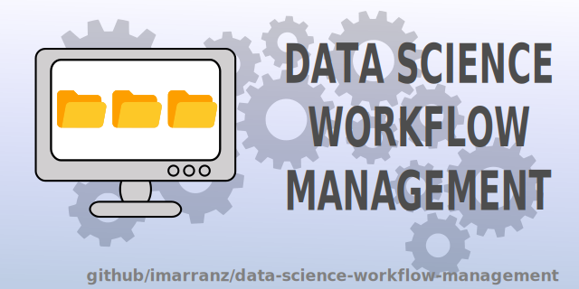

**Version and Activity**


<br>
**Analysis**


<br>

# Data Science Workflow Management



## Introducction

A good workflow means better results and reproducible researchs. A first step is to work with a nice structure of files and folders. In this repository I want to show _my_ workflow, it is not the best (I know) and for this reason I want to improve it. First, I followed the icebreakeR guidelines, and that was my first attempt at creating an efficient working structure. Later, new libraries and tools and Python as Data Science language were appearing. This changes made me to modify the primary structure. Besides, tools as github force us to add files as README.md or .gitignore.

In an efficient workflow, there is no only a good structure of files and folders, something more is needed. I usually use a [kanban](https://en.wikipedia.org/wiki/Kanban) methodology. A brief description of a kanban methodology starts with the means of _kanban_ word. It is a Japanese word that means _cards_. Each card identifies one process: definition, aim, person assings to that process and deadlines. Further, each _kanban_ is in blackboard that usually is divided in three columns: **to do**, **doing** (or in process) and **done**. Others columns can be added if the process requires it. We can also add tags to each card: _urgent_, _document_, _question_, _validation_, ... These tags facilitate you to give priorities to each subprocess.


At this point I think github is a good tool to work with _kanban_. In each repository you can associate a project based on the _kanban_ methodology. Initially, in github each _kanban_ is associated with a problem or issue and allows you to follow its process.

## Reproducible Research

  * [Reproducible Science](https://www.earthdatascience.org/courses/intro-to-earth-data-science/open-reproducible-science/get-started-open-reproducible-science/)
  * [Open Science](https://openscience.org/what-exactly-is-open-science/)


## Links & Resources

Links where I have learned about Data Science workflow. Many of the ideas I post here come from these resources.

### Websites

[Manage your Data Science project structure in early stage](https://towardsdatascience.com/manage-your-data-science-project-structure-in-early-stage-95f91d4d0600)  
[Best practices organizing data science projects](https://www.thinkingondata.com/how-to-organize-data-science-projects/)  
[Data Science Project Folder Structure](https://dzone.com/articles/data-science-project-folder-structure)  
[How to Structure a Python-Based Data Science Project (a short tutorial for beginners)](https://medium.com/swlh/how-to-structure-a-python-based-data-science-project-a-short-tutorial-for-beginners-7e00bff14f56)  
[Practical Data Science](https://www.practicaldatascience.org/html/index.html)  
[How To Organize Your Project: Best Practices for Open Reproducible Science](https://www.earthdatascience.org/courses/intro-to-earth-data-science/open-reproducible-science/get-started-open-reproducible-science/best-practices-for-organizing-open-reproducible-science/)  
[The Good way to structure a Python Project](https://medium.com/@thehippieandtheboss/the-good-way-to-structure-a-python-project-d914f27dfcc9)  
[Data Science Project Management](https://neptune.ai/blog/data-science-project-management)

### Documents & Books

[icebreakeR](https://cran.r-project.org/doc/contrib/Robinson-icebreaker.pdf)  

[GIT Notes for Professionals](https://books.goalkicker.com/GitBook/GitNotesForProfessionals.pdf) 

[MySQL Notes for Professionals](https://books.goalkicker.com/MySQLBook/MySQLNotesForProfessionals.pdf)  
[MongoDB Notes for Professionals](https://books.goalkicker.com/MongoDBBook/MongoDBNotesForProfessionals.pdf)  
[SQL Notes for Professionals](https://books.goalkicker.com/SQLBook/SQLNotesForProfessionals.pdf)  

### Articles

[Toward collaborative open data science in metabolomics using Jupyter Notebooks and cloud computing](https://link.springer.com/article/10.1007%2Fs11306-019-1588-0)


#### SQL

[3 SQL things I wish I knew as a data beginner](https://medium.com/@etrossat/3-sql-things-i-wish-i-knew-as-a-data-beginner-78efe6ab775c)  
[Four SQL Best Practices](https://medium.com/@Hong_Tang/four-sql-best-practices-helped-me-in-my-sql-interviews-68e686b6d28a)  
[SQL with notebooks](https://franherreragon.medium.com/lets-do-some-magic-with-sql-and-python-30ce38e37539)  
[SQL Cheat-Sheet for Data Science](https://medium.com/analytics-vidhya/sql-cheat-sheet-for-data-science-cf3005c0fb28)  
[SQL Coding Best Practices for Writing Clean Code](https://towardsdatascience.com/sql-coding-best-practices-for-writing-clean-code-a1eca1cccb93)  
[When Python meets SQL](https://medium.com/@jperezllorente/when-python-meets-sql-57b4d7ab2182)  
[Best practices for writing SQL queries](https://medium.com/@abdelilah.moulida/best-practices-for-writing-sql-queries-7c20b1b9d21e)  
[7 SQL Queries You Should Know as Data Analyst](https://medium.com/@alfiramdhan/7-sql-queries-you-should-know-as-data-analyst-6a16602fffbe)

#### SQLite


### Docs

If is necessary to keep the project with documentation in this folder we can do it. I like working with MkDocs and JupyterBooks. MkDocs is very easy to use. Normally I save my Jupyter Notebooks to markdown and with a brief configuration file is very fast to built a website. 

First, we need to convert the notebook to markdown. We can do it with [nbconvert](https://nbconvert.readthedocs.io/en/latest/index.html).

```
jupyter nbconvert --to markdown mynotebook.ipynb
```

  * [MkDocs](https://www.mkdocs.org/)  
  * [Sphinx](https://www.sphinx-doc.org/en/master/)  
  * [Jupyter Book](https://jupyterbook.org/intro.html)  
  
[Build Your Python Project Documentation With MkDocs](https://realpython.com/python-project-documentation-with-mkdocs/?utm_source=realpython&utm_medium=rss)  

### Images

Any image that you do not generate with code. For example: logos, images above methodology, ...

### Notebooks

Since 2016 I usually use Jupyter Notebooks, before I used Rstudio (a wonderful IDE for R) but I work more efficiently with Notebooks. I organize my work with Notebooks. Some awesome tips about organization:

  * [Organise your Jupyter Notebook](https://towardsdatascience.com/organise-your-jupyter-notebook-with-these-tips-d164d5dcd51f)  
  * [8 Guidelines to Create Professional Data Science Notebooks](https://towardsdatascience.com/8-guidelines-to-create-professional-data-science-notebooks-97572894b2e5)  
  * [Interactive Reporting in Jupyter Notebook](https://towardsdatascience.com/interactive-reporting-in-jupyter-notebook-92a4fa90c09a)

### References

There are always documentation before to start any Data Science Work. For example, bibliography, references, previously documentation, ... It is also important to keep manuals about libraries, especially if you use it for first time.

### Results

The results must be show 

### Source

#### Utils

#### Data


#### Processing

##### Clean

[5 Simple Tips to Writing CLEAN Python Code](https://medium.com/@Sabrina-Carpenter/5-simple-tips-to-writing-clean-python-code-and-save-time-f57970ca53ae)  
[Data Cleaning Techniques using Python](https://duarohan18.medium.com/data-cleaning-techniques-using-python-b6399f2550d5)  

##### Exploratory Data Analysis, EDA

[MITO, Python Data Analysis](https://www.trymito.io/)    
[Exploratory Data Analysis in Python](https://medium.com/@siddhardhan23/exploratory-data-analysis-25b7c0f0bfec)  
[Exploratory Data Analysis](https://mugekuskon.medium.com/how-to-perform-exploratory-data-analysis-5c3d944c13ff)  
[Advanced Exlporatory Data Analysis (EDA) with Python](https://medium.com/epfl-extension-school/advanced-exploratory-data-analysis-eda-with-python-536fa83c578a)  
[Advanced Exploratory data Analysis (EDA) in Python](https://kevinprinsloo.medium.com/advanced-eda-e6fea0193dbd)  
[Dealing With Missing Values in Python](https://medium.com/analytics-vidhya/data-cleaning-dealing-with-missing-values-in-python-f0bc95edf1c3)  


#### Visualization

[Ideas for Better Visualization](https://uxdesign.cc/20-ideas-for-better-data-visualization-73f7e3c2782d)  
[33 Data Visualization Techniques all Professionals Should Know](https://dipesious.medium.com/33-data-visualization-techniques-all-professionals-should-know-ab999abe601a)  
[Quick guide to Visualization in Python](https://medium.com/swlh/quick-guide-to-visualization-in-python-c3ee57c668b1)  
[Statistics: Visualize data using Python!](https://medium.com/analytics-vidhya/statistics-visualize-data-using-python-6d23aee7f6d7)  
[Data Visualization with Pandas in Action](https://levelup.gitconnected.com/data-visualization-with-pandas-in-action-1-98582b69ee8b)  
[Data Visualization in Seaborn with Awesome Examples](https://medium.com/@shankar.t3234/data-visualisation-in-seaborn-with-awesome-examples-b20cc5e2e271)  
    


| **Purpose**                    | **Library**     | **Description**                                                        | **Project & Documentation**                            |
|------------------------------|-----------------|------------------------------------------------------------------------|-------------------------------------------------------|
| Data Processing | pandas          | A powerful library for data manipulation and analysis.                 | [Project](https://pandas.pydata.org/)                 |
| Numerical Computing | numpy           | A fundamental library for numerical operations in Python.              | [Project](https://numpy.org/)                         |
| Scientific Computing | scipy           | An extensive library for scientific and statistical computations.       | [Project](https://www.scipy.org/)                    |
|                              | scikit-learn    | A comprehensive library for machine learning.                           | [Project](https://scikit-learn.org/stable/index.html) |
| Data Visualization           | matplotlib      | A versatile plotting library for creating various visualizations.       | [Project](https://matplotlib.org/)                   |
|                              | seaborn         | A high-level data visualization library based on matplotlib.           | [Project](https://seaborn.pydata.org/)               |
|                              | altair          | A declarative visualization library for creating interactive visuals.    | [Project](https://altair-viz.github.io/)            |
| Web Scraping and Text        | beautiful soup  | A popular library for parsing HTML and XML documents.                   | [Project](https://www.crummy.com/software/BeautifulSoup/bs4/doc/) |
| Processing                   | scrapy          | A powerful and flexible framework for web scraping and crawling.       | [Project](https://scrapy.org/)                      |
| Statistics and Data Analysis | pingouin        | A statistical library with a focus on easy-to-use functions.           | [Project](https://pingouin-stats.org/)               |
|                              | statannot       | A library for adding statistical annotations to visualizations.         | [Project](https://github.com/webermarcolivier/statannot) |
|                              | tableone        | A library for creating summary statistics tables.                       | [Project](https://github.com/tompollard/tableone)  |
|                              | missingno       | A library for visualizing missing data patterns in datasets.           | [Project](https://github.com/ResidentMario/missingno) |
| Database                     | sqlite3         | A Python module for interacting with SQLite databases.                  | [Documentation](https://docs.python.org/3/library/sqlite3.html) |
|                              | yaml            | A library for reading and writing YAML files.                           | [Project](https://pyyaml.org/)                      |
| Deep Learning                | tensorflow      | A popular open-source library for deep learning.                        | [Project](https://www.tensorflow.org/)              |
| Web Application Development  | streamlit       | A library for creating interactive web applications for data visualization and analysis. | [Project](https://www.streamlit.io/) |

## Index

  * Introduction
    * What is Data Science Workflow Management?
    * Why is Data Science Workflow Management Important?
  * Fundamentals of Data Science
    * What is Data Science?
    * Data Science Process
    * Programming Languages for Data Science
    * Data Science Tools and Technologies
  * Workflow Management Concepts
    * What is Workflow Management?
    * Why is Workflow Management Important?
    * Workflow Management Models
    * Workflow Management Tools and Technologies
    * Practical Example: How to Structure a Data Science Project Using Well-Organized Folders and Files
  * Project Planning
    * What is Project Planning?
    * Problem Definition and Objectives
    * Selection of Modeling Techniques
    * Selection of Tools and Technologies
    * Workflow Design
    * Practical Example: How to Use a Project Management Tool to Plan and Organize the Workflow of a Data Science Project
  * Data Acquisition and Preparation
    * What is Data Acquisition?
    * Selection of Data Sources
    * Data Extraction and Transformation
    * Data Cleaning
    * Data Integration
    * Practical Example: How to Use a Data Extraction and Cleaning Tool to Prepare a Dataset for Use in a Data Science Project
  * Exploratory Data Analysis
    * What is Exploratory Data Analysis?
    * Data Visualization
    * Statistical Analysis
    * Trend Analysis
    * Correlation Analysis
    * Practical Example: How to Use a Data Visualization Library to Explore and Analyze a Dataset
  * Modeling and Data Validation
    * What is Data Modeling?
    * Selection of Modeling Algorithms
    * Model Training and Validation
    * Selection of Best Model
    * Model Evaluation
    * Practical Example: How to Use a Machine Learning Library to Train and Evaluate a Prediction Model
  * Model Implementation and Maintenance
    * What is Model Implementation?
    * Selection of Implementation Platform
    * Integration with Existing Systems
    * Testing and Validation of the Model
    * Model Maintenance and Updating
    * Practical Example: How to Implement a Model on a Web Server Using a Model Implementation Library
  * Monitoring and Continuous Improvement
    * What is Monitoring and Continuous Improvement?
    * Model Performance Monitoring
    * Problem Identification
    * Continuous Model Improvement


```
tlmgr install adjustbox babel-german background bidi collectbox csquotes everypage filehook footmisc footnotebackref framed fvextra letltxmacro ly1 mdframed mweights needspace pagecolor sourcecodepro sourcesanspro titling ucharcat ulem unicode-math upquote xecjk xurl zref
```
