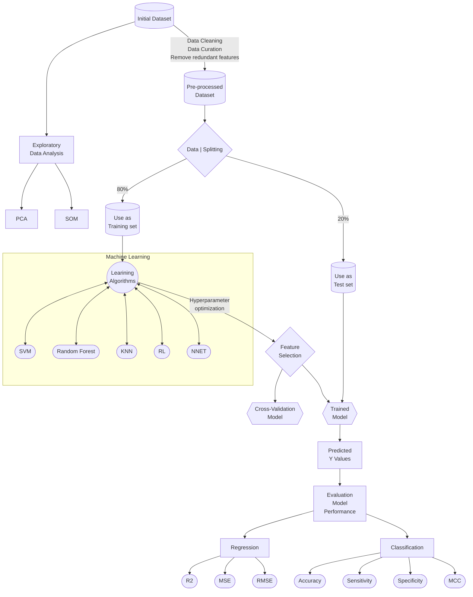
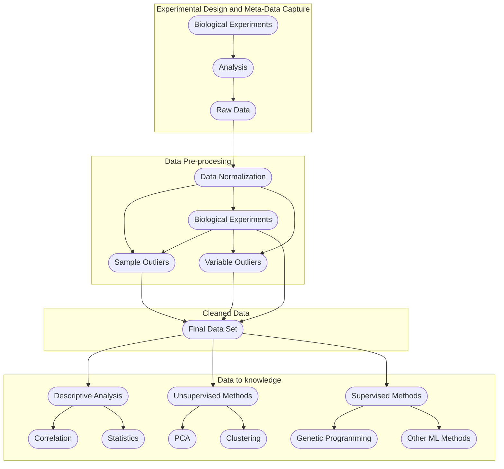

## Structure of a Data Science Project

The following structure gives an idea how to organize a complex Data Science Project. The source has been adapted from [here](https://medium.com/swlh/how-to-structure-a-python-based-data-science-project-a-short-tutorial-for-beginners-7e00bff14f56) and [here](https://github.com/dssg/hitchhikers-guide/tree/master/sources/curriculum/0_before_you_start/pipelines-and-project-workflow). The name of *.py files are only examples.

```
├── README.md  
├── requirements.txt  
├── .gitignore  
│  
├── config  
│    
├── data  
│   ├── d10_raw  
│   ├── d20_intermediate  
│   ├── d30_processed  
│   ├── d40_models  
│   ├── d50_model_output  
│   └── d60_reporting  
│    
├── docs  
│    
├── images  
│    
├── notebooks  
|    
├── references  
│    
├── results   
│  
└── source   
    ├── __init__.py   
    │    
    ├── s00_utils  
    │   └── YYYYMMDD-ima-remove_values.py  
    |   └── YYYYMMDD-ima-remove_samples.py  
    │   └── YYYYMMDD-ima-rename_samples.py    
    │    
    ├── s10_data  
    │   └── YYYYMMDD-ima-load_data.py    
    │    
    ├── s20_intermediate  
    │   └── YYYYMMDD-ima-create_intermediate_data.py    
    │    
    ├── s30_processing  
    │   └── YYYYMMDD-ima-create_master_table.py   
    |   └── YYYYMMDD-ima-create_descriptive_table.py   
    │    
    ├── s40_modelling
    │   └── YYYYMMDD-ima-importance_features.py       
    │   └── YYYYMMDD-ima-train_lr_model.py  
    │   └── YYYYMMDD-ima-train_svm_model.py  
    │   └── YYYYMMDD-ima-train_rf_model.py    
    │    
    ├── s50_model_evaluation   
    │   └── YYYYMMDD-ima-calculate_performance_metrics.py    
    │        
    ├── s60_reporting   
    │   └── YYYYMMDD-ima-create_summary.py    
    │   └── YYYYMMDD-ima-create_report.py  
    │    
    └── s70_visualisation   
        └── YYYYMMDD-ima-count_plot_for_categorical_features.py          
        └── YYYYMMDD-ima-distribution_plot_for_continuous_features.py          
        └── YYYYMMDD-ima-relational_plots.py          
        └── YYYYMMDD-ima-outliers_analysis_plots.py 
        └── YYYYMMDD-ima-visualise_model_results.py          
```        

  * README.md: The top-level README for developers. It is also the README of github. In this file we can write a brief description about the project. 
  
  * requeriments.txt: The requirements file for reproducing the analysis environment.
  
  * .gitignore: Avoids uploading data, credentials, outputs, system files, etc.   

  * \[config\]: Space for credentials and global configuration. For example, *.yaml[^yaml] files.  

  * \[data\]: Folder with data. According to the type of data, there are different subfolders.  
  
    * \[d10_raw\]: Folder with raw data. Data to read only.
    * \[d20_intermediate\]: Folder with transform data from raw data.
    * \[d30_processed\]: Folder with processed data: Normalization, ...
    * \[d40_models\]: Folder with data prepared to launch different models.
    * \[d50_model_output\]: Folder with outputs from modelling analysis.
    * \[d60_reporting\]: Folder with report data. Finally data.
    
  * \[docs\]: Space for [Sphinx](https://www.sphinx-doc.org), [MkDocs](https://www.mkdocs.org/) or [Jupyterbooks](https://jupyterbook.org/) documentation. With jupyter notebooks is very easy to generate documentation using jupterbook.
    * \[MkDocs\]: A very useful tool to make a website with documentation and results. Easy to configure and easy to generate.
    * \[Sphinx\]: A powerfull documentation tool. Unfortunately, I have not yet use it.
    * \[Jupyterbooks\]: A tool to generate a website from markdown or directly from jupyter notebooks. An example can be seen here: [PyGenMet Manual](http://www.imarranz.com/pygenmet-manual/docs/index.html)
  
  * \[images\]: Images necessaries to documents that they are no generated with code.

  * \[notebooks\]: Jupyter notebooks. Naming convention is date YYYYMMDD (for ordering), the author's initials, and a short `-` delimited description. 
  
  * \[references\]: Data dictionaries or metadata[^metadata], manuals, etc (notes icebreaker). Articles related to the project can also be stored in this folder.
  
  * \[results\]: Final analysis docs (output icebreaker). 
  
  * \[source\]: Source code for use in this project. The names of files are only examples. Each project needs different analysis. As notebooks files, I propose to follow the same convention.

    * \_\_init\_\_.py: Makes src a Python module.
    * \[s00_utils\]: Functions used across the project.
    * \[s10_data\]: Scripts to reading and writing data. In this point, the source of data can be very heterogeneous and we must to 
    * \[s20_intermediate\]: Scripts to transform data from raw to intermediate data.
    * \[s30_processing\]: Scripts to turn intermediate data into modelling input.
      * \[s31_missing\]: Examining and dropping data. Imputing data.
      * \[s32_clean\]: Cleaning data. Outliers detection.
      * \[s33_eda\]: Exploratory Data Analysis.
      * \[s34_poc\]: Proof of Concept.
    * \[s40_modelling\]: Scripts to train models and use them.      
      * \[s41_feature_selection\]: Scripts to select features that are useful or important to the model.
    * \[s50_model_evaluation\]: Scripts to analyze models.
    * \[s60_reporting\]: Scrips to produce reporting tables and outputs.
    * \[s70_visualization\]: Scripts to create frequently used plots.
      * \[s71_count\]: Examining categorical variables.
      * \[s72_distribution\]: Examining continuous variables.
      * \[s73_relational\]: Pair plots, correlation plots, ...
      * \[s74_outliers\]: Examining outliers.
      * \[s75_modelling\]: Visualize models results.
                                                                      

### README

A README file contains information about the project and other files in a directory or archives. Usually, a README is a form of documentation, it is a simple plain text. Is very common to use markdown to write a README ([more](https://en.wikipedia.org/wiki/README)). 

If you need more information about markdown in github you can go [here](https://docs.github.com/en/github/writing-on-github/getting-started-with-writing-and-formatting-on-github/basic-writing-and-formatting-syntax).


    
### Requeriments

With _requirements_ we are referring to the technical configuration of the project. If we are working with Python we have to describe the environment, list the packages used and their versions, ...

In the following codes I show how to work with the environments and how to save the project configuration. This is a very important step since it will allow us to reproduce the same analysis in the future even if the versions of the packages change.

```
conda activate project

conda list --export > project-package-list.txt
conda list --explicit > project-package-explicit-list.txt
conda info > project-info.txt
conda env export > project-env.yaml
```    

The first lines of the file `project-env.yaml` have the following code (as example):

```
name: project
channels:
  - conda-forge
  - r
  - defaults
dependencies:
  - alabaster=0.7.12=py_0
  - anyio=3.3.4=py37h03978a9_0
  - ...
```

If we want to reproduce the analysis we can create or reproduce the same environment. 


```
conda env create -f project-env.yaml 
```

You can explicit the name of the new environment

```
conda env create -n new-name -f project-env.yaml
conda env create --name new-name --file project-env.yaml
```

And then, we can activate the environment

```
conda activate project
```

When we do not need this environment we can remove it

```
conda env remove --name project
```


More information:

  * [conda](https://docs.conda.io/en/latest/)  
  * [conda list](https://docs.conda.io/projects/conda/en/latest/commands/list.html)               
  * [conda info](https://docs.conda.io/projects/conda/en/latest/commands/info.html)

Conda[^conda] [cheatsheet](https://docs.conda.io/projects/conda/en/4.6.0/_downloads/52a95608c49671267e40c689e0bc00ca/conda-cheatsheet.pdf).

### .gitignore

The `.gitignore` file is a specific file to work with git. In this file we can add the files or folder without tracking.

How `.gitignore` fil works:

  * **Ignore files**: To ignore a specific file
  
  ```
  namefile.ext
  ``` 
  
  This will ignore the file `namefile.ext`. 
  
  * **Ignore directories**: To ignore a specific directory:
  
  ```
  namefolder/
  ```
  
  This will ignore the folder `namefolder`. We cannot forget the `/` on the end.            
  
  * **Wildcard**: The symbol `*` matches with 0 or more characters. For example, `*.pdf` matches with any files ending with the `*.pdf` extension. We can also use the symbol `?` which matches any character except `/`. 
  
  * **Negation**: We can use the symbol `!` to avoid a file that we don't want to ignore. For example:
  
  ```
  *.pdf
  !CV.pdf
  ```   
  
  In this example, we will ignore all pdf files, except the `CV.pdf`.
  
<!--
https://www.pluralsight.com/guides/how-to-use-gitignore-file
-->

### Commits

A commit in GitHub (or others) is a saved change to a repository. It stores a snapshot of the changes made to a repository and includes a commit message describing the change. Commits are tracked and can be reverted if needed. They can also be shared and compared with other versions of a repository.

[Git Commit Emojis](https://gist.github.com/parmentf/035de27d6ed1dce0b36a)  
[Commit Message Emoji](https://github.com/dannyfritz/commit-message-emoji)  
[Emojis for Better Git Commit Messages](https://babakks.github.io/article/2020/07/03/emojis-in-git-commit-messages.html)  
[Emoji Commit Messages](https://github.com/cooperka/emoji-commit-messages)  
[Git commands](https://bootcamp.uxdesign.cc/git-commands-nobody-has-told-you-cd7025bea8db)  
[Semantic Commit Messages with Emojis](https://gist.github.com/alpteo/e93d754e5e09907c6362c4230fb66f87)


#### Semantic Commit Messages with Emojis

Commit format: `<emoji_type> <commit_type>(<scope>): <subject>. <issue_reference>`

##### Example
```
:sparkles: feat(Component): Add a new feature. Closes: #
^--------^ ^--^ ^-------^   ^---------------^  ^------^
|          |    |           |                  |
|          |    |           |                  +--> (Optional) Issue reference: if the commit closes or fixes an issue
|          |    |           |
|          |    |           +---------------------> Commit summary
|          |    |
|          |    +---------------------------------> (Optional) Commit scope in the project
|          |
|          +--------------------------------------> Commit type: feat, fix, docs, refactor, test, style, chore, build, perf or ci
|
+-------------------------------------------------> (Optional) Emoji type. See: https://gitmoji.carloscuesta.me/
```

**The commit message will be:**

> feat: Add a new feature

**With optional features emoji, scope and issue reference:**

> :sparkles: feat(Component): Add a new feature. Closes: #..

##### Commit Message Types

- **feat**: introducing a new feature to the codebase
- **fix**: fixing a bug in the codebase
- **docs**: adding or updating the documentation
- **refactor**: refactoring the production code
- **build**/**conf**: changes related to the build system (involving scripts, configurations) and package dependencies
- **test**: adding tests (no production code change)
- **ci**: changes related to the continuous integration and deployment system
- **style**: improving structure/format of the code e.g. missing semi colons (no production code change)
- **chore**: updating grunt tasks etc. (no production code change)
- **perf**: changes related to backward-compatible performance improvements

##### Supported Emojis by Commit Message Types

| Type     | Emoji                                           |
| -------- | ----------------------------------------------- |
| feat     | :sparkles: `:sparkles:`                         |
| fix      | :bug: `:bug:`                                   |
| docs     | :memo: `:memo:`                                 |
| refactor | :recycle: `:recycle:`                           |
| build    | :construction: `:construction:`                 |
| test     | :white_check_mark: `:white_check_mark:`         |
| ci       | :green_heart: `:green_heart:`                   |
| style    | :art: `:art:`                                   |
| chore    | :wrench: `:wrench:`                             |
| perf     | :zap: `:zap:`                                   |

Besides the emojis of these commit types, other related emojis can also be used in the commit messages. For example:

`:construction_worker: build(Electron): Bump version 7 to 9 :arrow_up:`

> :construction_worker: build(Electron): Bump version 7 to 9 :arrow_up:

##### Issue Referencing

Keywords to close an related issue with the commit:
- close
- closes
- closed
- fix
- fixes
- fixed
- resolve
- resolves
- resolved

You can use the phrase: `Fixes: #1` or `Fixes #1`.
Once the branch is merged into the default branch, the issue will close.

##### References
 - https://gitmoji.carloscuesta.me/
 - http://karma-runner.github.io/1.0/dev/git-commit-msg.html
 - https://nitayneeman.com/posts/understanding-semantic-commit-messages-using-git-and-angular/


### Config

### Data

#### Data Analysis (DA)

[Data Analysis with Python](https://medium.com/geekculture/data-analysis-da-with-python-c570264edeab)  

Data Analysis is the previous step before any analysis. Usually Data Analysis has three categories:

  1. Descriptive. This step is usually [Exploratory Data Analysis](#exploratory-data-analysis-eda). What information do we have?
  2. Diagnostic. To answer our questions. What does the data say us?  
  3. Predictive. Use our data to [predict](#modelling) new events.

Usually, data has the following process:

  1. First, we need to collect the data from different and heterogeneous sources. Maybe, the data has different structures or formats.
  2. We must to coerce all different data in a same structure and format (a SQL or NoSQL Database).
  3. In this point, we need to normalizate all variables: same units, same categories, ... clean the data.
  4. Once we have the standardized data, we can start the modelling process.


#### SQL

SQL (Structured Query Language) is a special-purpose language used to communicate with databases. It is used to store, retrieve, manipulate and delete data in relational database systems. With SQL, you can create and modify databases, as well as control user access to them. It is also used to create and execute queries on the data stored in the databases, and to generate reports from the data. SQL is also used to define and modify the structure of the databases, and to add data integrity constraints to the data.

[3 SQL things I wish I knew as a data beginner](https://medium.com/@etrossat/3-sql-things-i-wish-i-knew-as-a-data-beginner-78efe6ab775c)  
[Four SQL Best Practices](https://medium.com/@Hong_Tang/four-sql-best-practices-helped-me-in-my-sql-interviews-68e686b6d28a)  
[SQL with notebooks](https://franherreragon.medium.com/lets-do-some-magic-with-sql-and-python-30ce38e37539)  
[SQL Cheat-Sheet for Data Science](https://medium.com/analytics-vidhya/sql-cheat-sheet-for-data-science-cf3005c0fb28)  
[SQL Coding Best Practices for Writing Clean Code](https://towardsdatascience.com/sql-coding-best-practices-for-writing-clean-code-a1eca1cccb93)  
[When Python meets SQL](https://medium.com/@jperezllorente/when-python-meets-sql-57b4d7ab2182)  
[Best practices for writing SQL queries](https://medium.com/@abdelilah.moulida/best-practices-for-writing-sql-queries-7c20b1b9d21e)  
[7 SQL Queries You Should Know as Data Analyst](https://medium.com/@alfiramdhan/7-sql-queries-you-should-know-as-data-analyst-6a16602fffbe)  
[TOP 8 Best practices for writing SQL queries!!!](https://medium.com/@abdelilah.moulida/best-practices-for-writing-sql-queries-7c20b1b9d21e)  
[9 SQL Core Concepts](https://towardsdatascience.com/9-sql-core-concepts-that-helped-me-get-my-first-data-analyst-job-a582f892276f)  

#### SQLite

SQLite is an open source, self-contained, serverless, zero-configuration, transactional SQL database engine. It is the most widely deployed SQL database engine in the world. It is used in various applications such as web browsers, operating systems, and embedded systems. SQLite does not have a client/server architecture, but operates as a local, embedded database engine. It is ACID-compliant and implements most of the SQL standard, using a dynamically and weakly typed SQL syntax that is similar to but slightly different from standard SQL.

### Docs

If is necessary to keep the project with documentation in this folder we can do it. I like working with MkDocs and JupyterBooks. MkDocs is very easy to use. Normally I save my Jupyter Notebooks to markdown and with a brief configuration file is very fast to built a website. 

First, we need to convert the notebook to markdown. We can do it with [nbconvert](https://nbconvert.readthedocs.io/en/latest/index.html).

```
jupyter nbconvert --to markdown mynotebook.ipynb
```

  * [MkDocs](https://www.mkdocs.org/)  
  * [Sphinx](https://www.sphinx-doc.org/en/master/)  
  * [Jupyter Book](https://jupyterbook.org/intro.html)  
  
[Build Your Python Project Documentation With MkDocs](https://realpython.com/python-project-documentation-with-mkdocs/?utm_source=realpython&utm_medium=rss)  

### Images

Any image that you do not generate with code. For example: logos, images above methodology, ...

### Notebooks

Since 2016 I usually use Jupyter Notebooks, before I used Rstudio (a wonderful IDE for R) but I work more efficiently with Notebooks. I organize my work with Notebooks. Some awesome tips about organization:

  * [Organise your Jupyter Notebook](https://towardsdatascience.com/organise-your-jupyter-notebook-with-these-tips-d164d5dcd51f)  
  * [8 Guidelines to Create Professional Data Science Notebooks](https://towardsdatascience.com/8-guidelines-to-create-professional-data-science-notebooks-97572894b2e5)  
  * [Interactive Reporting in Jupyter Notebook](https://towardsdatascience.com/interactive-reporting-in-jupyter-notebook-92a4fa90c09a)

### References

There are always documentation before to start any Data Science Work. For example, bibliography, references, previously documentation, ... It is also important to keep manuals about libraries, especially if you use it for first time.

### Results

The results must be show 

### Source

#### Utils

#### Data


#### Processing

##### Clean

[5 Simple Tips to Writing CLEAN Python Code](https://medium.com/@Sabrina-Carpenter/5-simple-tips-to-writing-clean-python-code-and-save-time-f57970ca53ae)  
[Data Cleaning Techniques using Python](https://duarohan18.medium.com/data-cleaning-techniques-using-python-b6399f2550d5)  

##### Exploratory Data Analysis, EDA

Exploratory data analysis (EDA) is a statistical process for analyzing and summarizing data to discover meaningful patterns, correlations, and insights. These insights can then be used to build more accurate predictive models and better understand the data set. EDA involves exploratory graphs such as histograms, scatterplots, boxplots and more, as well as various measures of central tendency and variability. By exploring the data, we can gain a better understanding of our data and the underlying relationships between variables.

[MITO, Python Data Analysis](https://www.trymito.io/)    
[Exploratory Data Analysis in Python](https://medium.com/@siddhardhan23/exploratory-data-analysis-25b7c0f0bfec)  
[Exploratory Data Analysis](https://mugekuskon.medium.com/how-to-perform-exploratory-data-analysis-5c3d944c13ff)  
[Advanced Exlporatory Data Analysis (EDA) with Python](https://medium.com/epfl-extension-school/advanced-exploratory-data-analysis-eda-with-python-536fa83c578a)  
[Advanced Exploratory data Analysis (EDA) in Python](https://kevinprinsloo.medium.com/advanced-eda-e6fea0193dbd)  
[Dealing With Missing Values in Python](https://medium.com/analytics-vidhya/data-cleaning-dealing-with-missing-values-in-python-f0bc95edf1c3)  


##### Proof of Concept, POC

A proof of concept (POC) in data science is a prototype or small experiment used to demonstrate the potential of a data-driven solution or analytic model. The purpose of a proof of concept is to provide evidence that an idea is feasible and can be further developed into a successful product, solution, or project. This typically involves collecting, analyzing, and visualizing data in order to test the viability of the original hypothesis or concept.

By proving the concept, a data scientist can assess the impact a particular product or solution could have on the organization, and whether it is worth the risk and cost to move forward with the project.

A POC generally involves a small subset of data and a portion of the proposed solution being tested. This may include analyzing small customer segmentation samples or creating a limited version of the model or algorithms to be used. Once the data is acquired and the model is built, the data scientist can then assess if the model provides useful results, and if the solution proposed is feasible.

The proof of concept is an important step for any project that requires data science and analytics. It helps to identify any errors or weaknesses in the data or the proposed solution, before investing further resources into the project and provides a way to inform the decision makers of the organization if a particular project or solution is viable or not.

#### Modelling





##### Performance

A performance of a model in data science is a measure of how well the model is able to learn from data and make predictions. In other words, it is a way to measure the accuracy, robustness, and usability of the model. A good performance of a model usually indicates that the model is able to generalize well, meaning that it is able to accurately predict or make decisions with data that it has not been trained on before.

The performance of a model can be measured with different metrics such as accuracy, precision, recall, F1-score, confusion matrix, and the area under the curve. Accuracy is the percentage of correct predictions or the number of correct predictions divided by the total number of predictions made. Precision is the number of correct positive predictions divided by the total number of positive predictions made. Recall is the number of correct positive predictions divided by the total number of positive cases. F1-score is a metric that combines accuracy and recall, and it is computed by taking the harmonic mean of precision and recall. A confusion matrix is a table that helps to summarize the performance of a model by presenting the number of true positives, false positives, true negatives, and false negatives. Finally, the area under the curve of a model is generally calculated by plotting the true positive rate against the false positive rate, and then computing the area under the resulting curve.

The performance of a model depends on the type of model that is built and the data used to train it. A model with better performance should be able to learn from data quickly and accurately, while also being able to generalize well to unseen data. Data scientists use different techniques such as feature selection, hyperparameter tuning, cross-validation, and ensemble learning to improve the performance of a model and make sure that it can accurately predict or make decisions with data that it has not been trained on before.

[Overcoming overfitting a model in Machine Learning](https://medium.com/@jwbtmf/overcoming-overfitting-a-model-in-machine-learning-7dd6324d15bf) 


#### Visualization

Data visualization is a critical component of data science, allowing researchers and decision-makers to better understand, communicate, and draw insights from large datasets. While its use has long been a major aspect of descriptive statistics, modern data visualization has become increasingly complex and sophisticated, now utilizing a wide range of advanced graphical techniques and interactive displays.

At its core, data visualization involves the use of graphical elements such as charts, graphs, and maps to visually display numeric values and other data in an organized way. This can help reveal the underlying story in a dataset, allowing the user to make more informed decisions and predictions. Data visualization tools can also reveal correlations and patterns in data that may not be otherwise detectable using traditional methods of analysis.

The rise of big data has increased the importance of data visualization. With the sheer volume of data that is now being generated, using traditional methods of analysis is often not feasible. Data visualization helps put a face on big data, allowing users to quickly get an overview of what it contains and to analyze it in more depth.

Data visualization also helps bridge the gap between data analysis and communication. Through the use of visuals, data can be quickly and easily communicated to a wide audience, regardless of their technical knowledge. It also helps to reinforce the credibility of the message being conveyed, as the visuals can make it easier to draw insights from the data and to make sure that everyone has the same understanding of the data.

Data visualization has become a crucial tool for data science, enabling researchers and decision-makers to extract key insights from large datasets and to communicate them to a wide audience. By utilizing advanced graphical techniques and interactive displays, data visualization allows users to quickly get an overview of a dataset and to easily convey their findings to others.

[Ideas for Better Visualization](https://uxdesign.cc/20-ideas-for-better-data-visualization-73f7e3c2782d)  
[33 Data Visualization Techniques all Professionals Should Know](https://dipesious.medium.com/33-data-visualization-techniques-all-professionals-should-know-ab999abe601a)  
[Quick guide to Visualization in Python](https://medium.com/swlh/quick-guide-to-visualization-in-python-c3ee57c668b1)  
[Statistics: Visualize data using Python!](https://medium.com/analytics-vidhya/statistics-visualize-data-using-python-6d23aee7f6d7)  
[Data Visualization with Pandas in Action](https://levelup.gitconnected.com/data-visualization-with-pandas-in-action-1-98582b69ee8b)  
[Data Visualization in Seaborn with Awesome Examples](https://medium.com/@shankar.t3234/data-visualisation-in-seaborn-with-awesome-examples-b20cc5e2e271)  
    
    
#### Save Data

It is important to save data or models in order to reproduce the investigation. Python has to important libraries to do that:

  * [pickle](https://docs.python.org/3/library/pickle.html): The pickle module implements binary protocols for serializing and de-serializing a Python object structure.
  * [joblib](https://joblib.readthedocs.io/en/latest/): Joblib is a set of tools to provide **lightweight pipelining in Python**.

[Is it betteer to save models using joblib or pickle?](https://medium.com/nlplanet/is-it-better-to-save-models-using-joblib-or-pickle-7767722b5a095)

[^metadata]: A data dictionary, or metadata repository, as defined in the IBM Dictionary of Computing, is a "centralized repository of information about data such as meaning, relationships to other data, origin, usage, and format"
[^yaml]: YAML is a human-readable data-serialization language. It is commonly used for configuration files and in applications where data is being stored or transmitted. 
[^conda]: Conda is an open source package management system and environment management system that runs on Windows, macOS and Linux. Conda quickly installs, runs and updates packages and their dependencies.
 
