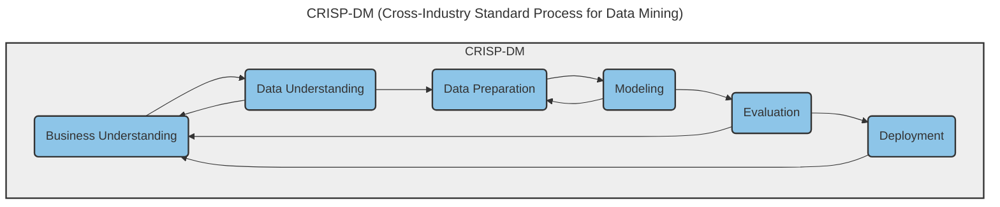
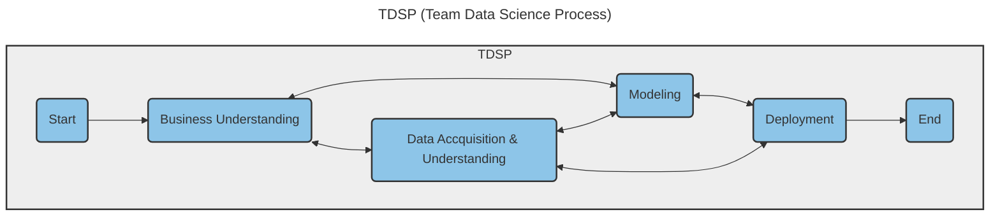
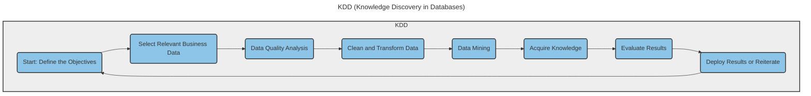
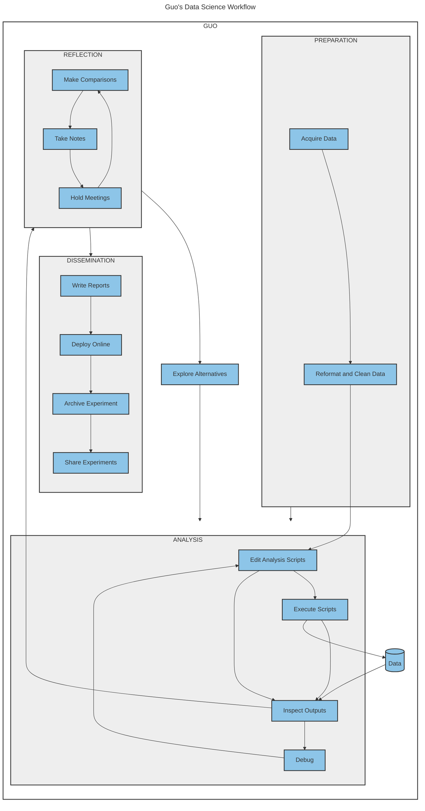
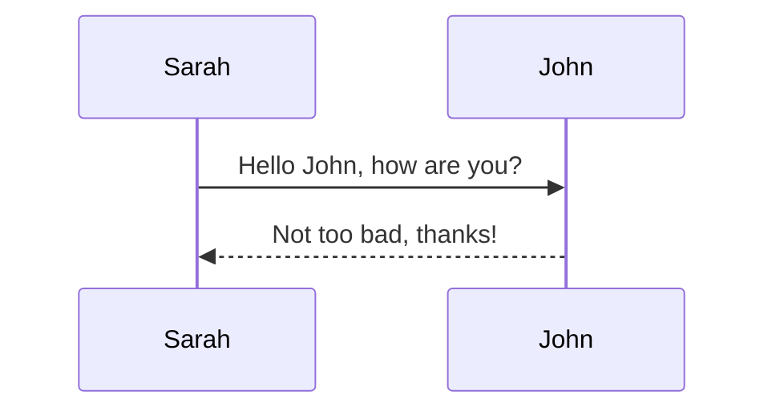
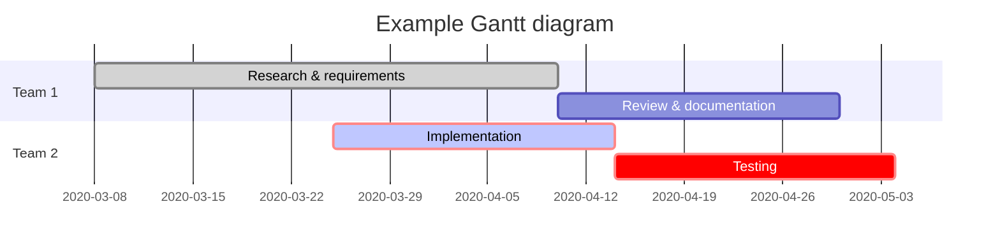

## Workflow Management Models

Workflow management models are essential to ensure the smooth and efficient execution of data science projects. These models provide a framework for managing the flow of data and tasks from the initial stages of data collection and processing to the final stages of analysis and interpretation. They help ensure that each stage of the project is properly planned, executed, and monitored, and that the project team is able to collaborate effectively and efficiently.

One commonly used model in data science is the CRISP-DM (Cross-Industry Standard Process for Data Mining) model. This model consists of six phases: business understanding, data understanding, data preparation, modeling, evaluation, and deployment. The CRISP-DM model provides a structured approach to data mining projects and helps ensure that the project team has a clear understanding of the business goals and objectives, as well as the data available and the appropriate analytical techniques.

Another popular workflow management model in data science is the TDSP (Team Data Science Process) model developed by Microsoft. This model consists of five phases: business understanding, data acquisition and understanding, modeling, deployment, and customer acceptance. The TDSP model emphasizes the importance of collaboration and communication among team members, as well as the need for continuous testing and evaluation of the analytical models developed.

In addition to these models, there are also various agile project management methodologies that can be applied to data science projects. For example, the Scrum methodology is widely used in software development and can also be adapted to data science projects. This methodology emphasizes the importance of regular team meetings and iterative development, allowing for flexibility and adaptability in the face of changing project requirements.

Regardless of the specific workflow management model used, the key is to ensure that the project team has a clear understanding of the overall project goals and objectives, as well as the roles and responsibilities of each team member. Communication and collaboration are also essential, as they help ensure that each stage of the project is properly planned and executed, and that any issues or challenges are addressed in a timely manner.

Overall, workflow management models are critical to the success of data science projects. They provide a structured approach to project management, ensuring that the project team is able to work efficiently and effectively, and that the project goals and objectives are met. By implementing the appropriate workflow management model for a given project, data scientists can maximize the value of the data and insights they generate, while minimizing the time and resources required to do so.

### Models

In the realm of data science, several established workflow management models help guide teams through the complexities of data projects. These models are designed to ensure that every phase of a project aligns with business objectives and leverages data insights effectively.

#### CRISP-DM (Cross-Industry Standard Process for Data Mining)

CRISP-DM is a widely adopted model that provides a comprehensive framework for carrying out data mining projects. It consists of six phases: business understanding, data understanding, data preparation, modeling, evaluation, and deployment. This model emphasizes a cyclical process allowing for continuous improvements based on insights gained from previous iterations.

#### TDSP (Team Data Science Process)

Developed by Microsoft, TDSP structures projects into five key phases: business understanding, data acquisition and understanding, modeling, deployment, and customer acceptance. It stresses the importance of iterative learning and effective communication within data science teams.

#### KDD (Knowledge Discovery in Databases)

KDD is a non-linear, iterative process focusing on the discovery of actionable knowledge from large volumes of data. This process involves selection, preprocessing, transformation, data mining, and the interpretation of the discovered patterns.

#### Guo's Data Science Workflow

Guo's model is particularly useful for ensuring that data science projects are reproducible and transparent. It suggests a workflow where programming and exploratory data analysis are carried out in tandem, allowing for a deeper understanding and more robust analysis.

