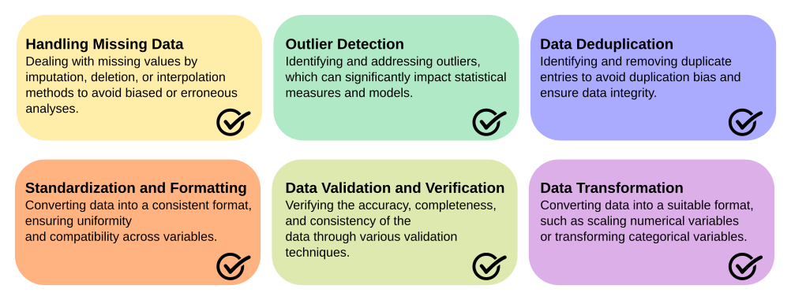

## Data Cleaning

**Data Cleaning: Ensuring Data Quality for Effective Analysis**

Data cleaning, also known as data cleansing or data scrubbing, is a crucial step in the data science workflow that focuses on identifying and rectifying errors, inconsistencies, and inaccuracies within datasets. It is an essential process that precedes data analysis, as the quality and reliability of the data directly impact the validity and accuracy of the insights derived from it.

The importance of data cleaning lies in its ability to enhance data quality, reliability, and integrity. By addressing issues such as missing values, outliers, duplicate entries, and inconsistent formatting, data cleaning ensures that the data is accurate, consistent, and suitable for analysis. Clean data leads to more reliable and robust results, enabling data scientists to make informed decisions and draw meaningful insights.

Several common techniques are employed in data cleaning, including:

  * **Handling Missing Data**: Dealing with missing values by imputation, deletion, or interpolation methods to avoid biased or erroneous analyses.

  * **Outlier Detection**: Identifying and addressing outliers, which can significantly impact statistical measures and models.

  * **Data Deduplication**: Identifying and removing duplicate entries to avoid duplication bias and ensure data integrity.

  * **Standardization and Formatting**: Converting data into a consistent format, ensuring uniformity and compatibility across variables.

  * **Data Validation and Verification**: Verifying the accuracy, completeness, and consistency of the data through various validation techniques.

  * **Data Transformation**: Converting data into a suitable format, such as scaling numerical variables or transforming categorical variables.

Python and R offer a rich ecosystem of libraries and packages that aid in data cleaning tasks. Some widely used libraries and packages for data cleaning in Python include:

<table border="1" style="width: 100%; border-collapse: collapse;">
    <caption>Key Python libraries and packages for data handling and processing.</caption>
    <tr>
        <th style="width: 15%;">Purpose</th>
        <th style="width: 20%;">Library/Package</th>
        <th style="width: 50%;">Description</th>
        <th style="width: 15%;">Website</th>
    </tr>
    <tr>
        <td>Missing Data Handling</td>
        <td>pandas</td>
        <td>A versatile library for data manipulation in Python, providing functions for handling missing data, imputation, and data cleaning.</td>
        <td><a href="https://pandas.pydata.org">pandas</a></td>
    </tr>
    <tr>
        <td>Outlier Detection</td>
        <td>scikit-learn</td>
        <td>A comprehensive machine learning library in Python that offers various outlier detection algorithms, enabling robust identification and handling of outliers.</td>
        <td><a href="https://scikit-learn.org">scikit-learn</a></td>
    </tr>
    <tr>
        <td>Data Deduplication</td>
        <td>pandas</td>
        <td>Alongside its data manipulation capabilities, pandas also provides methods for identifying and removing duplicate data entries, ensuring data integrity.</td>
        <td><a href="https://pandas.pydata.org">pandas</a></td>
    </tr>
    <tr>
        <td>Data Formatting</td>
        <td>pandas</td>
        <td>pandas offers extensive functionalities for data transformation, including data type conversion, formatting, and standardization.</td>
        <td><a href="https://pandas.pydata.org">pandas</a></td>
    </tr>
    <tr>
        <td>Data Validation</td>
        <td>pandas-schema</td>
        <td>A Python library that enables the validation and verification of data against predefined schema or constraints, ensuring data quality and integrity.</td>
        <td><a href="https://github.com/alexrsdesenv/pandas-schema">pandas-schema</a></td>
    </tr>
</table>

 

**Handling Missing Data**: Dealing with missing values by imputation, deletion, or interpolation methods to avoid biased or erroneous analyses.

**Outlier Detection**: Identifying and addressing outliers, which can significantly impact statistical measures and model predictions.

**Data Deduplication**: Identifying and removing duplicate entries to avoid duplication bias and ensure data integrity.

**Standardization and Formatting**: Converting data into a consistent format, ensuring uniformity and compatibility across variables.

**Data Validation and Verification**: Verifying the accuracy, completeness, and consistency of the data through various validation techniques.

**Data Transformation**: Converting data into a suitable format, such as scaling numerical variables or transforming categorical variables.

In R, various packages are specifically designed for data cleaning tasks:

<table border="1" style="width: 100%; border-collapse: collapse;">
    <caption>Essential R packages for data handling and analysis.</caption>
    <tr>
        <th style="width: 20%;">Purpose</th>
        <th style="width: 15%;">Package</th>
        <th style="width: 55%;">Description</th>
        <th style="width: 10%;">Website</th>
    </tr>
    <tr>
        <td>Missing Data Handling</td>
        <td>tidyr</td>
        <td>A package in R that offers functions for handling missing data, reshaping data, and tidying data into a consistent format.</td>
        <td><a href="https://tidyr.tidyverse.org">tidyr</a></td>
    </tr>
    <tr>
        <td>Outlier Detection</td>
        <td>dplyr</td>
        <td>As a part of the tidyverse, dplyr provides functions for data manipulation in R, including outlier detection and handling.</td>
        <td><a href="https://dplyr.tidyverse.org">dplyr</a></td>
    </tr>
    <tr>
        <td>Data Formatting</td>
        <td>lubridate</td>
        <td>A package in R that facilitates handling and formatting dates and times, ensuring consistency and compatibility within the dataset.</td>
        <td><a href="https://lubridate.tidyverse.org">lubridate</a></td>
    </tr>
    <tr>
        <td>Data Validation</td>
        <td>validate</td>
        <td>An R package that provides a declarative approach for defining validation rules and validating data against them, ensuring data quality and integrity.</td>
        <td><a href="https://cran.r-project.org/package=validate">validate</a></td>
    </tr>
    <tr>
        <td rowspan="2">Data Transformation</td>
        <td>tidyr</td>
        <td>tidyr offers functions for reshaping and transforming data, facilitating tasks such as pivoting, gathering, and spreading variables.</td>
        <td><a href="https://tidyr.tidyverse.org">tidyr</a></td>
    </tr>
    <tr>
        <td>stringr</td>
        <td>A package that provides various string manipulation functions in R, useful for data cleaning tasks involving text data.</td>
        <td><a href="https://stringr.tidyverse.org">stringr</a></td>
    </tr>
</table>

 

These libraries and packages offer a wide range of functionalities for data cleaning in both Python and R. They empower data scientists to efficiently handle missing data, detect outliers, remove duplicates, standardize formatting, validate data, and transform variables to ensure high-quality and reliable datasets for analysis. Feel free to explore their respective websites for more information, documentation, and examples of their usage.

### The Importance of Data Cleaning in Omics Sciences: Focus on Metabolomics

Omics sciences, such as metabolomics, play a crucial role in understanding the complex molecular mechanisms underlying biological systems. Metabolomics aims to identify and quantify small molecule metabolites in biological samples, providing valuable insights into various physiological and pathological processes. However, the success of metabolomics studies heavily relies on the quality and reliability of the data generated, making data cleaning an essential step in the analysis pipeline.

Data cleaning is particularly critical in metabolomics due to the high dimensionality and complexity of the data. Metabolomic datasets often contain a large number of variables (metabolites) measured across multiple samples, leading to inherent challenges such as missing values, batch effects, and instrument variations. Failing to address these issues can introduce bias, affect statistical analyses, and hinder the accurate interpretation of metabolomic results.

To ensure robust and reliable metabolomic data analysis, several techniques are commonly applied during the data cleaning process:

  * **Missing Data Imputation**: Since metabolomic datasets may have missing values due to various reasons (e.g., analytical limitations, low abundance), imputation methods are employed to estimate and fill in the missing values, enabling the inclusion of complete data in subsequent analyses.

  * **Batch Effect Correction**: Batch effects, which arise from technical variations during sample processing, can obscure true biological signals in metabolomic data. Various statistical methods, such as ComBat, remove or adjust for batch effects, allowing for accurate comparisons and identification of significant metabolites.

  * **Outlier Detection and Removal**: Outliers can arise from experimental errors or biological variations, potentially skewing statistical analyses. Robust outlier detection methods, such as median absolute deviation (MAD) or robust regression, are employed to identify and remove outliers, ensuring the integrity of the data.

  * **Normalization**: Normalization techniques, such as median scaling or probabilistic quotient normalization (PQN), are applied to adjust for systematic variations and ensure comparability between samples, enabling meaningful comparisons across different experimental conditions.

  * **Feature Selection**: In metabolomics, feature selection methods help identify the most relevant metabolites associated with the biological question under investigation. By reducing the dimensionality of the data, these techniques improve model interpretability and enhance the detection of meaningful metabolic patterns.

Data cleaning in metabolomics is a rapidly evolving field, and several tools and algorithms have been developed to address these challenges. Notable software packages include [XCMS](https://xcmsonline.scripps.edu/), [MetaboAnalyst](https://www.metaboanalyst.ca/), and [MZmine](https://mzmine.github.io/mzmine_documentation/), which offer comprehensive functionalities for data preprocessing, quality control, and data cleaning in metabolomics studies.
