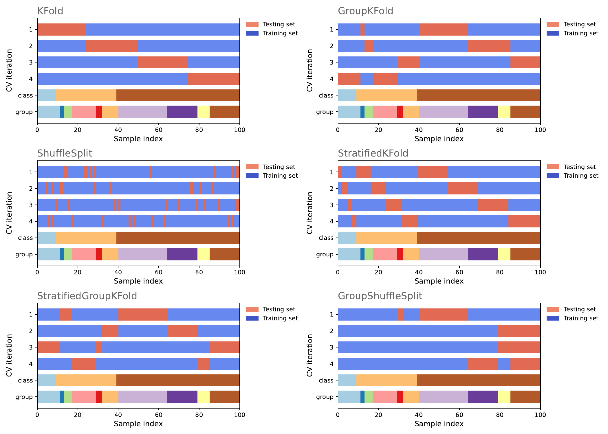

## Model Evaluation

Model evaluation is a crucial step in the modeling and data validation process. It involves assessing the performance of a trained model to determine its accuracy and generalizability. The goal is to understand how well the model performs on unseen data and to make informed decisions about its effectiveness.

There are various metrics used for evaluating models, depending on whether the task is regression or classification. In regression tasks, common evaluation metrics include mean squared error (MSE), root mean squared error (RMSE), mean absolute error (MAE), and R-squared. These metrics provide insights into the model's ability to predict continuous numerical values accurately.

For classification tasks, evaluation metrics focus on the model's ability to classify instances correctly. These metrics include accuracy, precision, recall, F1 score, and area under the receiver operating characteristic curve (ROC AUC). Accuracy measures the overall correctness of predictions, while precision and recall evaluate the model's performance on positive and negative instances. The F1 score combines precision and recall into a single metric, balancing their trade-off. ROC AUC quantifies the model's ability to distinguish between classes.

Additionally, cross-validation techniques are commonly employed to evaluate model performance. K-fold cross-validation divides the data into K equally-sized folds, where each fold serves as both training and validation data in different iterations. This approach provides a robust estimate of the model's performance by averaging the results across multiple iterations.

Proper model evaluation helps to identify potential issues such as overfitting or underfitting, allowing for model refinement and selection of the best performing model. By understanding the strengths and limitations of the model, data scientists can make informed decisions and enhance the overall quality of their modeling efforts.

In machine learning, evaluation metrics are crucial for assessing model performance. The **Mean Squared Error (MSE)** measures the average squared difference between the predicted and actual values in regression tasks. This metric is computed using the `mean_squared_error` function in the `scikit-learn` library.

Another related metric is the **Root Mean Squared Error (RMSE)**, which represents the square root of the MSE to provide a measure of the average magnitude of the error. It is typically calculated by taking the square root of the MSE value obtained from `scikit-learn`.

The **Mean Absolute Error (MAE)** computes the average absolute difference between predicted and actual values, also in regression tasks. This metric can be calculated using the `mean_absolute_error` function from `scikit-learn`.

**R-squared** is used to measure the proportion of the variance in the dependent variable that is predictable from the independent variables. It is a key performance metric for regression models and can be found in the `statsmodels` library.

For classification tasks, **Accuracy** calculates the ratio of correctly classified instances to the total number of instances. This metric is obtained using the `accuracy_score` function in `scikit-learn`.

**Precision** represents the proportion of true positive predictions among all positive predictions. It helps determine the accuracy of the positive class predictions and is computed using `precision_score` from `scikit-learn`.

**Recall**, or Sensitivity, measures the proportion of true positive predictions among all actual positives in classification tasks, using the `recall_score` function from `scikit-learn`.

The **F1 Score** combines precision and recall into a single metric, providing a balanced measure of a model's accuracy and recall. It is calculated using the `f1_score` function in `scikit-learn`.

Lastly, the **ROC AUC** quantifies a model's ability to distinguish between classes. It plots the true positive rate against the false positive rate and can be calculated using the `roc_auc_score` function from `scikit-learn`.

These metrics are essential for evaluating the effectiveness of machine learning models, helping developers understand model performance in various tasks. Each metric offers a different perspective on model accuracy and error, allowing for comprehensive performance assessments.

###  Common Cross-Validation Techniques for Model Evaluation

Cross-validation is a fundamental technique in machine learning for robustly estimating model performance. Below, I describe some of the most common cross-validation techniques:

  * **K-Fold Cross-Validation**: In this technique, the dataset is divided into approximately equal-sized k partitions (folds). The model is trained and evaluated k times, each time using k-1 folds as training data and 1 fold as test data. The evaluation metric (e.g., accuracy, mean squared error, etc.) is calculated for each iteration, and the results are averaged to obtain an estimate of the model's performance.

  * **Leave-One-Out (LOO) Cross-Validation**: In this approach, the number of folds is equal to the number of samples in the dataset. In each iteration, the model is trained with all samples except one, and the excluded sample is used for testing. This method can be computationally expensive and may not be practical for large datasets, but it provides a precise estimate of model performance.

  * **Stratified Cross-Validation**: Similar to k-fold cross-validation, but it ensures that the class distribution in each fold is similar to the distribution in the original dataset. Particularly useful for imbalanced datasets where one class has many more samples than others.

  * **Randomized Cross-Validation (Shuffle-Split)**: Instead of fixed k-fold splits, random divisions are made in each iteration. Useful when you want to perform a specific number of iterations with random splits rather than a predefined k.

  * **Group K-Fold Cross-Validation**: Used when the dataset contains groups or clusters of related samples, such as subjects in a clinical study or users on a platform. Ensures that samples from the same group are in the same fold, preventing the model from learning information that doesn't generalize to new groups.

These are some of the most commonly used cross-validation techniques. The choice of the appropriate technique depends on the nature of the data and the problem you are addressing, as well as computational constraints. Cross-validation is essential for fair model evaluation and reducing the risk of overfitting or underfitting.

<table border="1" style="width: 100%; border-collapse: collapse;">
    <caption>Cross-Validation techniques in machine learning. Functions from module <code>sklearn.model_selection</code>.</caption>
    <tr>
        <th style="width: 20%;">Cross-Validation Technique</th>
        <th style="width: 60%;">Description</th>
        <th style="width: 20%;">Python Function</th>
    </tr>
    <tr>
        <td>K-Fold Cross-Validation</td>
        <td>Divides the dataset into k partitions and trains/tests the model k times. It's widely used and versatile.</td>
        <td><code>.KFold()</code></td>
    </tr>
    <tr>
        <td>Leave-One-Out (LOO) Cross-Validation</td>
        <td>Uses the number of partitions equal to the number of samples in the dataset, leaving one sample as the test set in each iteration. Precise but computationally expensive.</td>
        <td><code>.LeaveOneOut()</code></td>
    </tr>
    <tr>
        <td>Stratified Cross-Validation</td>
        <td>Similar to k-fold but ensures that the class distribution is similar in each fold. Useful for imbalanced datasets.</td>
        <td><code>.StratifiedKFold()</code></td>
    </tr>
    <tr>
        <td>Randomized Cross-Validation (Shuffle-Split)</td>
        <td>Performs random splits in each iteration. Useful for a specific number of iterations with random splits.</td>
        <td><code>.ShuffleSplit()</code></td>
    </tr>
    <tr>
        <td>Group K-Fold Cross-Validation</td>
        <td>Designed for datasets with groups or clusters of related samples. Ensures that samples from the same group are in the same fold.</td>
        <td>Custom implementation (use group indices and customize splits).</td>
    </tr>
</table>

  
