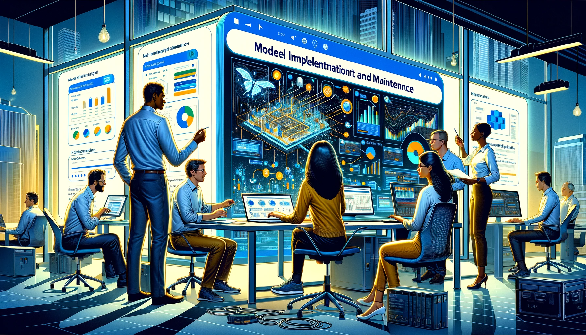

## Model Implementation and Maintenance

In the field of data science and machine learning, model implementation and maintenance play a crucial role in bringing the predictive power of models into real-world applications. Once a model has been developed and validated, it needs to be deployed and integrated into existing systems to make meaningful predictions and drive informed decisions. Additionally, models require regular monitoring and updates to ensure their performance remains optimal over time.

This chapter explores the various aspects of model implementation and maintenance, focusing on the practical considerations and best practices involved. It covers topics such as deploying models in production environments, integrating models with data pipelines, monitoring model performance, and handling model updates and retraining.

The successful implementation of models involves a combination of technical expertise, collaboration with stakeholders, and adherence to industry standards. It requires a deep understanding of the underlying infrastructure, data requirements, and integration challenges. Furthermore, maintaining models involves continuous monitoring, addressing potential issues, and adapting to changing data dynamics.

Throughout this chapter, we will delve into the essential steps and techniques required to effectively implement and maintain machine learning models. We will discuss real-world examples, industry case studies, and the tools and technologies commonly employed in this process. By the end of this chapter, readers will have a comprehensive understanding of the considerations and strategies needed to deploy, monitor, and maintain models for long-term success.

