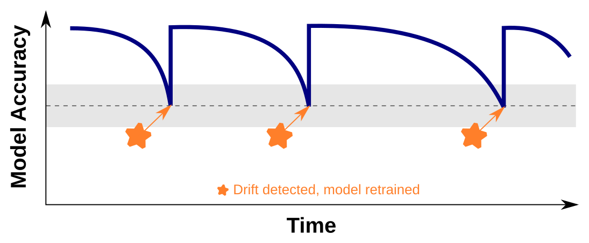

## What is Monitoring and Continuous Improvement?

Monitoring and continuous improvement in data science refer to the ongoing process of assessing and enhancing the performance, accuracy, and relevance of models deployed in real-world scenarios. It involves the systematic tracking of key metrics, identifying areas of improvement, and implementing corrective measures to ensure optimal model performance.

Monitoring encompasses the regular evaluation of the model's outputs and predictions against ground truth data. It aims to identify any deviations, errors, or anomalies that may arise due to changing conditions, data drift, or model decay. By monitoring the model's performance, data scientists can detect potential issues early on and take proactive steps to rectify them.

Continuous improvement emphasizes the iterative nature of refining and enhancing the model's capabilities. It involves incorporating feedback from stakeholders, evaluating the model's performance against established benchmarks, and leveraging new data to update and retrain the model. The goal is to ensure that the model remains accurate, relevant, and aligned with the evolving needs of the business or application.

The process of monitoring and continuous improvement involves various activities. These include:

  * **Performance Monitoring**: Tracking key performance metrics, such as accuracy, precision, recall, or mean squared error, to assess the model's overall effectiveness.

  * **Drift Detection**: Identifying and monitoring data drift, concept drift, or distributional changes in the input data that may impact the model's performance.

  * **Error Analysis**: Investigating errors or discrepancies in model predictions to understand their root causes and identify areas for improvement.

  * **Feedback Incorporation**: Gathering feedback from end-users, domain experts, or stakeholders to gain insights into the model's limitations or areas requiring improvement.

  * **Model Retraining**: Periodically updating the model by retraining it on new data to capture evolving patterns, account for changes in the underlying environment, and enhance its predictive capabilities.

  * **A/B Testing**: Conducting controlled experiments to compare the performance of different models or variations to identify the most effective approach.

By implementing robust monitoring and continuous improvement practices, data science teams can ensure that their models remain accurate, reliable, and provide value to the organization. It fosters a culture of learning and adaptation, allowing for the identification of new opportunities and the optimization of existing models.

### Performance Monitoring

Performance monitoring is a critical aspect of the monitoring and continuous improvement process in data science. It involves tracking and evaluating key performance metrics to assess the effectiveness and reliability of deployed models. By monitoring these metrics, data scientists can gain insights into the model's performance, detect anomalies or deviations, and make informed decisions regarding model maintenance and enhancement.

Some commonly used performance metrics in data science include:

  * **Accuracy**: Measures the proportion of correct predictions made by the model over the total number of predictions. It provides an overall indication of the model's correctness.

  * **Precision**: Represents the ability of the model to correctly identify positive instances among the predicted positive instances. It is particularly useful in scenarios where false positives have significant consequences.

  * **Recall**: Measures the ability of the model to identify all positive instances among the actual positive instances. It is important in situations where false negatives are critical.

  * **F1 Score**: Combines precision and recall into a single metric, providing a balanced measure of the model's performance.

  * **Mean Squared Error (MSE)**: Commonly used in regression tasks, MSE measures the average squared difference between predicted and actual values. It quantifies the model's predictive accuracy.

  * **Area Under the Curve (AUC)**: Used in binary classification tasks, AUC represents the overall performance of the model in distinguishing between positive and negative instances.

To effectively monitor performance, data scientists can leverage various techniques and tools. These include:

  * **Tracking Dashboards**: Setting up dashboards that visualize and display performance metrics in real-time. These dashboards provide a comprehensive overview of the model's performance, enabling quick identification of any issues or deviations.

  * **Alert Systems**: Implementing automated alert systems that notify data scientists when specific performance thresholds are breached. This helps in identifying and addressing performance issues promptly.

  * **Time Series Analysis**: Analyzing the performance metrics over time to detect trends, patterns, or anomalies that may impact the model's effectiveness. This allows for proactive adjustments and improvements.

  * **Model Comparison**: Conducting comparative analyses of different models or variations to determine the most effective approach. This involves evaluating multiple models simultaneously and tracking their performance metrics.

By actively monitoring performance metrics, data scientists can identify areas that require attention and make data-driven decisions regarding model maintenance, retraining, or enhancement. This iterative process ensures that the deployed models remain reliable, accurate, and aligned with the evolving needs of the business or application.

Here is a table showcasing different Python libraries for generating dashboards:

<table border="1" style="width: 100%; border-collapse: collapse;">
    <caption>Python web application and visualization libraries.</caption>
    <tr>
        <th style="width: 15%;">Library</th>
        <th style="width: 70%;">Description</th>
        <th style="width: 15%;">Website</th>
    </tr>
    <tr>
        <td>Dash</td>
        <td>A framework for building analytical web apps.</td>
        <td><a href="https://dash.plotly.com/">dash.plotly.com</a></td>
    </tr>
    <tr>
        <td>Streamlit</td>
        <td>A simple and efficient tool for data apps.</td>
        <td><a href="https://www.streamlit.io/">www.streamlit.io</a></td>
    </tr>
    <tr>
        <td>Bokeh</td>
        <td>Interactive visualization library.</td>
        <td><a href="https://docs.bokeh.org/">docs.bokeh.org</a></td>
    </tr>
    <tr>
        <td>Panel</td>
        <td>A high-level app and dashboarding solution.</td>
        <td><a href="https://panel.holoviz.org/">panel.holoviz.org</a></td>
    </tr>
    <tr>
        <td>Plotly</td>
        <td>Data visualization library with interactive plots.</td>
        <td><a href="https://plotly.com/python/">plotly.com</a></td>
    </tr>
    <tr>
        <td>Flask</td>
        <td>Micro web framework for building dashboards.</td>
        <td><a href="https://flask.palletsprojects.com/">flask.palletsprojects.com</a></td>
    </tr>
    <tr>
        <td>Voila</td>
        <td>Convert Jupyter notebooks into interactive dashboards.</td>
        <td><a href="https://voila.readthedocs.io/">voila.readthedocs.io</a></td>
    </tr>
</table>

 

These libraries provide different functionalities and features for building interactive and visually appealing dashboards. Dash and Streamlit are popular choices for creating web applications with interactive visualizations. Bokeh and Plotly offer powerful tools for creating interactive plots and charts. Panel provides a high-level app and dashboarding solution with support for different visualization libraries. Flask is a micro web framework that can be used to create customized dashboards. Voila is useful for converting Jupyter notebooks into standalone dashboards.

### Drift Detection

Drift detection is a crucial aspect of monitoring and continuous improvement in data science. It involves identifying and quantifying changes or shifts in the data distribution over time, which can significantly impact the performance and reliability of deployed models. Drift can occur due to various reasons such as changes in user behavior, shifts in data sources, or evolving environmental conditions.

Detecting drift is important because it allows data scientists to take proactive measures to maintain model performance and accuracy. There are several techniques and methods available for drift detection:

  * **Statistical Methods**: Statistical methods, such as hypothesis testing and statistical distance measures, can be used to compare the distributions of new data with the original training data. Significant deviations in statistical properties can indicate the presence of drift.

  * **Change Point Detection**: Change point detection algorithms identify points in the data where a significant change or shift occurs. These algorithms detect abrupt changes in statistical properties or patterns and can be applied to various data types, including numerical, categorical, and time series data.

  * **Ensemble Methods**: Ensemble methods involve training multiple models on different subsets of the data and monitoring their individual performance. If there is a significant difference in the performance of the models, it may indicate the presence of drift.

  * **Online Learning Techniques**: Online learning algorithms continuously update the model as new data arrives. By comparing the performance of the model on recent data with the performance on historical data, drift can be detected.

  * **Concept Drift Detection**: Concept drift refers to changes in the underlying concepts or relationships between input features and output labels. Techniques such as concept drift detectors and drift-adaptive models can be used to detect and handle concept drift.

It is essential to implement drift detection mechanisms as part of the model monitoring process. When drift is detected, data scientists can take appropriate actions, such as retraining the model with new data, adapting the model to the changing data distribution, or triggering alerts for manual intervention.

Drift detection helps ensure that models continue to perform optimally and remain aligned with the dynamic nature of the data they operate on. By continuously monitoring for drift, data scientists can maintain the reliability and effectiveness of the models, ultimately improving their overall performance and value in real-world applications.

### Error Analysis

Error analysis is a critical component of monitoring and continuous improvement in data science. It involves investigating errors or discrepancies in model predictions to understand their root causes and identify areas for improvement. By analyzing and understanding the types and patterns of errors, data scientists can make informed decisions to enhance the model's performance and address potential limitations.

The process of error analysis typically involves the following steps:

  * **Error Categorization**: Errors are categorized based on their nature and impact. Common categories include false positives, false negatives, misclassifications, outliers, and prediction deviations. Categorization helps in identifying the specific types of errors that need to be addressed.

  * **Error Attribution**: Attribution involves determining the contributing factors or features that led to the occurrence of errors. This may involve analyzing the input data, feature importance, model biases, or other relevant factors. Understanding the sources of errors helps in identifying areas for improvement.

  * **Root Cause Analysis**: Root cause analysis aims to identify the underlying reasons or factors responsible for the errors. It may involve investigating data quality issues, model limitations, missing features, or inconsistencies in the training process. Identifying the root causes helps in devising appropriate corrective measures.

  * **Feedback Loop and Iterative Improvement**: Error analysis provides valuable feedback for iterative improvement. Data scientists can use the insights gained from error analysis to refine the model, retrain it with additional data, adjust hyperparameters, or consider alternative modeling approaches. The feedback loop ensures continuous learning and improvement of the model's performance.

Error analysis can be facilitated through various techniques and tools, including visualizations, confusion matrices, precision-recall curves, ROC curves, and performance metrics specific to the problem domain. It is important to consider both quantitative and qualitative aspects of errors to gain a comprehensive understanding of their implications.

By conducting error analysis, data scientists can identify specific weaknesses in the model, uncover biases or data quality issues, and make informed decisions to improve its performance. Error analysis plays a vital role in the ongoing monitoring and refinement of models, ensuring that they remain accurate, reliable, and effective in real-world applications.

### Feedback Incorporation

Feedback incorporation is an essential aspect of monitoring and continuous improvement in data science. It involves gathering feedback from end-users, domain experts, or stakeholders to gain insights into the model's limitations or areas requiring improvement. By actively seeking feedback, data scientists can enhance the model's performance, address user needs, and align it with the evolving requirements of the application.

The process of feedback incorporation typically involves the following steps:

  * **Soliciting Feedback**: Data scientists actively seek feedback from various sources, including end-users, domain experts, or stakeholders. This can be done through surveys, interviews, user testing sessions, or feedback mechanisms integrated into the application. Feedback can provide valuable insights into the model's performance, usability, relevance, and alignment with the desired outcomes.

  * **Analyzing Feedback**: Once feedback is collected, it needs to be analyzed and categorized. Data scientists assess the feedback to identify common patterns, recurring issues, or areas of improvement. This analysis helps in prioritizing the feedback and determining the most critical aspects to address.

  * **Incorporating Feedback**: Based on the analysis, data scientists incorporate the feedback into the model development process. This may involve making updates to the model's architecture, feature selection, training data, or fine-tuning the model's parameters. Incorporating feedback ensures that the model becomes more accurate, reliable, and aligned with the expectations of the end-users.

  * **Iterative Improvement**: Feedback incorporation is an iterative process. Data scientists continuously gather feedback, analyze it, and make improvements to the model accordingly. This iterative approach allows for the model to evolve over time, adapting to changing requirements and user needs.

Feedback incorporation can be facilitated through collaboration and effective communication channels between data scientists and stakeholders. It promotes a user-centric approach to model development, ensuring that the model remains relevant and effective in solving real-world problems.

By actively incorporating feedback, data scientists can address limitations, fine-tune the model's performance, and enhance its usability and effectiveness. Feedback from end-users and stakeholders provides valuable insights that guide the continuous improvement process, leading to better models and improved decision-making in data science applications.

### Model Retraining

Model retraining is a crucial component of monitoring and continuous improvement in data science. It involves periodically updating the model by retraining it on new data to capture evolving patterns, account for changes in the underlying environment, and enhance its predictive capabilities. As new data becomes available, retraining ensures that the model remains up-to-date and maintains its accuracy and relevance over time.

The process of model retraining typically follows these steps:

  * **Data Collection**: New data is collected from various sources to augment the existing dataset. This can include additional observations, updated features, or data from new sources. The new data should be representative of the current environment and reflect any changes or trends that have occurred since the model was last trained.

  * **Data Preprocessing**: Similar to the initial model training, the new data needs to undergo preprocessing steps such as cleaning, normalization, feature engineering, and transformation. This ensures that the data is in a suitable format for training the model.

  * **Model Training**: The updated dataset, combining the existing data and new data, is used to retrain the model. The training process involves selecting appropriate algorithms, configuring hyperparameters, and fitting the model to the data. The goal is to capture any emerging patterns or changes in the underlying relationships between variables.

  * **Model Evaluation**: Once the model is retrained, it is evaluated using appropriate evaluation metrics to assess its performance. This helps determine if the updated model is an improvement over the previous version and if it meets the desired performance criteria.

  * **Deployment**: After successful evaluation, the retrained model is deployed in the production environment, replacing the previous version. The updated model is then ready to make predictions and provide insights based on the most recent data.

  * **Monitoring and Feedback**: Once the retrained model is deployed, it undergoes ongoing monitoring and gathers feedback from users and stakeholders. This feedback can help identify any issues or discrepancies and guide further improvements or adjustments to the model.

Model retraining ensures that the model remains effective and adaptable in dynamic environments. By incorporating new data and capturing evolving patterns, the model can maintain its predictive capabilities and deliver accurate and relevant results. Regular retraining helps mitigate the risk of model decay, where the model's performance deteriorates over time due to changing data distributions or evolving user needs.

In summary, model retraining is a vital practice in data science that ensures the model's accuracy and relevance over time. By periodically updating the model with new data, data scientists can capture evolving patterns, adapt to changing environments, and enhance the model's predictive capabilities.

### A/B testing

A/B testing is a valuable technique in data science that involves conducting controlled experiments to compare the performance of different models or variations to identify the most effective approach. It is particularly useful when there are multiple candidate models or approaches available and the goal is to determine which one performs better in terms of specific metrics or key performance indicators (KPIs).

The process of A/B testing typically follows these steps:

  * **Formulate Hypotheses**: The first step in A/B testing is to formulate hypotheses regarding the models or variations to be tested. This involves defining the specific metrics or KPIs that will be used to evaluate their performance. For example, if the goal is to optimize click-through rates on a website, the hypothesis could be that Variation A will outperform Variation B in terms of conversion rates.

  * **Design Experiment**: A well-designed experiment is crucial for reliable and interpretable results. This involves splitting the target audience or dataset into two or more groups, with each group exposed to a different model or variation. Random assignment is often used to ensure unbiased comparisons. It is essential to control for confounding factors and ensure that the experiment is conducted under similar conditions.

  * **Implement Models/Variations**: The models or variations being compared are implemented in the experimental setup. This could involve deploying different machine learning models, varying algorithm parameters, or presenting different versions of a user interface or system behavior. The implementation should be consistent with the hypothesis being tested.

  * **Collect and Analyze Data**: During the experiment, data is collected on the performance of each model/variation in terms of the defined metrics or KPIs. This data is then analyzed to compare the outcomes and assess the statistical significance of any observed differences. Statistical techniques such as hypothesis testing, confidence intervals, or Bayesian analysis may be applied to draw conclusions.

  * **Draw Conclusions**: Based on the data analysis, conclusions are drawn regarding the performance of the different models/variants. This includes determining whether any observed differences are statistically significant and whether the hypotheses can be accepted or rejected. The results of the A/B testing provide insights into which model or approach is more effective in achieving the desired objectives.

  * **Implement Winning Model/Variation**: If a clear winner emerges from the A/B testing, the winning model or variation is selected for implementation. This decision is based on the identified performance advantages and aligns with the desired goals. The selected model/variation can then be deployed in the production environment or used to guide further improvements.

A/B testing provides a robust methodology for comparing and selecting models or variations based on real-world performance data. By conducting controlled experiments, data scientists can objectively evaluate different approaches and make data-driven decisions. This iterative process allows for continuous improvement, as underperforming models can be discarded or refined, and successful models can be further optimized or enhanced.

In summary, A/B testing is a powerful technique in data science that enables the comparison of different models or variations to identify the most effective approach. By designing and conducting controlled experiments, data scientists can gather empirical evidence and make informed decisions based on observed performance. A/B testing plays a vital role in the continuous improvement of models and the optimization of key performance metrics.

<table border="1" style="width: 100%; border-collapse: collapse;">
    <caption>Python libraries for A/B testing and experimental design.</caption>
    <tr>
        <th style="width: 15%;">Library</th>
        <th style="width: 70%;">Description</th>
        <th style="width: 15%;">Website</th>
    </tr>
    <tr>
        <td>Statsmodels</td>
        <td>A statistical library providing robust functionality for experimental design and analysis, including A/B testing.</td>
        <td><a href="https://www.statsmodels.org/stable/index.html">Statsmodels</a></td>
    </tr>
    <tr>
        <td>SciPy</td>
        <td>A library offering statistical and numerical tools for Python. It includes functions for hypothesis testing, such as t-tests and chi-square tests, commonly used in A/B testing.</td>
        <td><a href="https://docs.scipy.org/doc/scipy/reference/index.html">SciPy</a></td>
    </tr>
    <tr>
        <td>pyAB</td>
        <td>A library specifically designed for conducting A/B tests in Python. It provides a user-friendly interface for designing and running A/B experiments, calculating performance metrics, and performing statistical analysis.</td>
        <td><a href="https://github.com/rahulpsathyaraj/pyAB">pyAB</a></td>
    </tr>
    <tr>
        <td>Evan</td>
        <td>Evan is a Python library for A/B testing. It offers functions for random treatment assignment, performance statistic calculation, and report generation.</td>
        <td><a href="https://evan.readthedocs.io/en/latest/">Evan</a></td>
    </tr>
</table>

 
