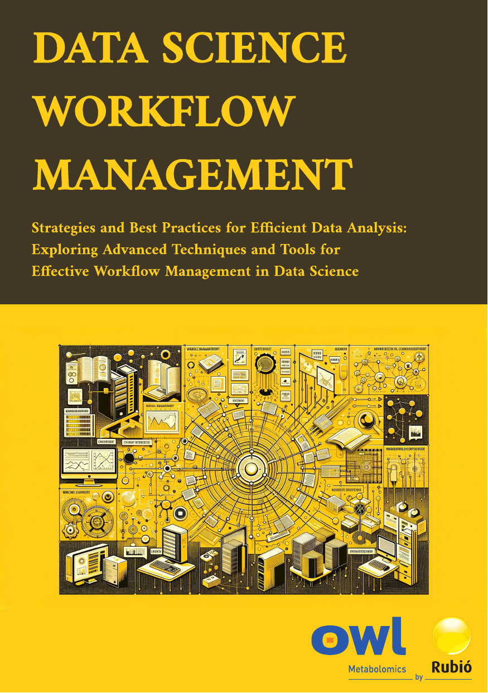

# Data Science Workflow Management

## Project

This project aims to provide a comprehensive guide for data science workflow management, detailing strategies and best practices for efficient data analysis and effective management of data science tools and techniques.

    

        

            
        

        

            
<b>Strategies and Best Practices for Efficient Data Analysis: Exploring Advanced Techniques and Tools for Effective Workflow Management in Data Science</b>

            
Welcome to the Data Science Workflow Management project. This documentation provides an overview of the tools, techniques, and best practices for managing data science workflows effectively.

            

            
            
            
            <a href="https://github.com/imarranz/data-science-workflow-management"> 
            
            

        

    

## Contact Information

For any inquiries or further information about this project, please feel free to contact Ibon Martínez-Arranz. Below you can find his contact details and social media profiles.

    

        

            
        

        

            
I'm Ibon Martínez-Arranz, with a BSc in Mathematics and MScs in Applied Statistics and Mathematical Modeling. Since 2010, I've been with <a href="https://owlmetabolomics.com/">OWL Metabolomics</a>, initially as a researcher and now head of the Data Science Department, focusing on prediction, statistical computations, and supporting R&D projects.

            
            
            
            
        

    

## Project Overview

The goal of this project is to create a comprehensive guide for data science workflow management, including data acquisition, cleaning, analysis, modeling, and deployment. Effective workflow management ensures that projects are completed on time, within budget, and with high levels of accuracy and reproducibility.

## Table of Contents

<h3>Fundamentals of Data Science</h3>

This chapter introduces the basic concepts of data science, including the data science process and the essential tools and programming languages used. Understanding these fundamentals is crucial for anyone entering the field, providing a foundation upon which all other knowledge is built.

<h3>Workflow Management Concepts</h3>

Here, we explore the concepts and importance of workflow management in data science. This chapter covers different models and tools for managing workflows, emphasizing how effective management can lead to more efficient and successful projects.

<h3>Project Planning</h3>

This chapter focuses on the planning phase of data science projects, including defining problems, setting objectives, and choosing appropriate modeling techniques and tools. Proper planning is essential to ensure that projects are well-organized and aligned with business goals.

<h3>Data Acquisition and Preparation</h3>

In this chapter, we delve into the processes of acquiring and preparing data. This includes selecting data sources, data extraction, transformation, cleaning, and integration. High-quality data is the backbone of any data science project, making this step critical.

<h3>Exploratory Data Analysis</h3>

This chapter covers techniques for exploring and understanding the data. Through descriptive statistics and data visualization, we can uncover patterns and insights that inform the modeling process. This step is vital for ensuring that the data is ready for more advanced analysis.

<h3>Modeling and Data Validation</h3>

Here, we discuss the process of building and validating data models. This chapter includes selecting algorithms, training models, evaluating performance, and ensuring model interpretability. Effective modeling and validation are key to developing accurate and reliable predictive models.

<h3>Model Implementation and Maintenance</h3>

The final chapter focuses on deploying models into production and maintaining them over time. Topics include selecting an implementation platform, integrating models with existing systems, and ongoing testing and updates. Ensuring models are effectively implemented and maintained is crucial for their long-term success and utility.

